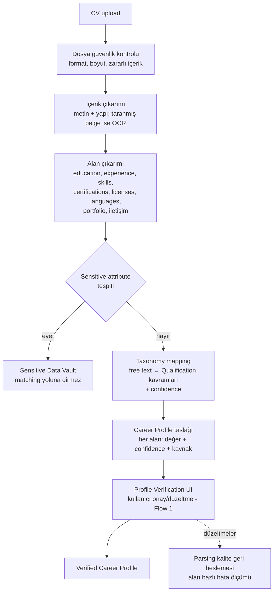

# AI_SYSTEM.md — CV Parsing, Extraction ve AI Bias & Fairness

> **Purpose:** AI destekli anlama katmanlarının sahibi: CV parsing / profile extraction
> flow, ilan requirement extraction'ın AI boyutu ve AI bias & fairness risk yönetimi.
> Matching'in bu çıktıları nasıl kullandığı: [MATCHING_ENGINE.md](MATCHING_ENGINE.md).
> Kavram uzayı: [OCCUPATION_TAXONOMY.md](OCCUPATION_TAXONOMY.md).
> Teknoloji seçimi yapılmamıştır (D-001): "AI bileşeni" burada yöntem-bağımsız
> yetenek olarak tanımlanır (T-009 karşılaştırma çalışmasıyla somutlaşır).

## 1. CV Parsing ve Profile Extraction Flow

Kurallar:

- **Onaysız alan matching'e "verified" girmez** (FR-103); unverified alanlar düşük
  confidence ile işlenir.
- **Confidence zorunlu:** her çıkarılan alan `{value, confidence, source_span}` taşır;
  düşük confidence alanlar verification UI'da öne çıkarılır ("bunu kontrol et").
- **Sensitive ayrıştırma parse anında yapılır** (D-006): doğum tarihi, fotoğraf, medeni
  durum, din vb. profile taslağına değil vault'a gider; kullanıcıya "bu bilgiler
  eşleştirmede kullanılmıyor" bilgisi verilir.
- **Kullanıcı düzeltmeleri ölçüm verisidir:** hangi alanın ne sıklıkla düzeltildiği,
  parsing kalitesinin ana metriğidir (CV parsing field accuracy,
  [METRICS.md](../product/METRICS.md)).
- **Çok dillilik (V1, F-22):** parsing hedef pazar diliyle başlar; dil tespiti +
  dil-bağımsız taxonomy kavramları genişlemeyi taşır.

## 2. Job Requirement Extraction (AI boyutu)

Pipeline'daki yeri [SCRAPING_SYSTEM.md](SCRAPING_SYSTEM.md) (Parser/Extractor);
burada anlama davranışı:

- Serbest ilan metninden requirement adayları çıkarılır ve üç seviyeye ayrılır
  (hard / required / preferred). Ayrım sinyalleri: "şarttır/zorunlu" vs "tercih
  sebebi"; yasal kalıplar (license, belge adları) hard adayıdır.
- Her requirement taxonomy kavramına bağlanmaya çalışılır; bağlanamayan `free_text`
  kalır (semantic eşleşmeye düşer).
- **Asimetrik hata politikası:** birini "hard" sanmak (yanlış eleme) ile "hard"ı
  kaçırmak (yanlış umut) farklı maliyettedir. Kural: hard sınıflaması yüksek confidence
  ister; emin olunmayan şart "required (belirsiz)" işlenir ve explanation'da "ilan
  metninde şart olabilir, kontrol et" dilinde sunulur.
- Structured data (sayfa içi işaretleme, API alanları) her zaman serbest metin
  çıkarımına tercih edilir.

## 3. AI Bileşenlerinin Ortak Kuralları

1. **Evidence zorunluluğu:** AI çıktısı, kaynağını (metin parçası/alan) gösterebilmeli —
   explanation'lar yalnızca evidence'lı iddialar içerir (hallucination sınırı).
2. **Versiyonlama:** parser/extractor/model versiyonları provenance'a işlenir;
   versiyon değişimi golden set regression'ından geçer.
3. **İnsan yedeği:** düşük confidence → Manual Review Queue veya kullanıcı doğrulaması;
   AI hiçbir yerde tek karar verici değildir.
4. **Veri minimizasyonu:** AI bileşenlerine yalnızca işleri için gereken alanlar gider;
   CV'nin tamamının harici bir servise gönderilmesi gerekiyorsa bu, privacy
   değerlendirmesinden geçer ([PRIVACY_SECURITY_COMPLIANCE.md](../security/PRIVACY_SECURITY_COMPLIANCE.md)).
   ❓ OPEN: harici AI servis kullanımına izin verilecek mi, hangi veri sınıflarıyla? (T-009 + T-008)

## 4. AI Bias ve Fairness Risks

Politika sahibi matching tarafında ([MATCHING_ENGINE.md](MATCHING_ENGINE.md) → Fairness
Constraints); burada risklerin sistematik dökümü ve önlemler:

| # | Risk | Nerede doğar | Önlem |
|---|---|---|---|
| B-1 | Sensitive attribute'ın doğrudan kullanımı | Parsing → matching veri yolu | Vault izolasyonu + leakage testi (0 tolerans) |
| B-2 | Proxy bias (mezuniyet yılı=yaş, isim, semt) | Faktör tasarımı | Proxy dikkat listesi; faktör ekleme sürecindeki fairness kontrolü |
| B-3 | Extraction kalitesinin dile/formata göre değişmesi (özenli CV yazan avantajlı, blue-collar CV'leri dezavantajlı) | CV parsing | Segment bazlı parsing accuracy ölçümü; CV'siz manuel yol eş değerli tutulur (F-03) |
| B-4 | İlan metinlerindeki ayrımcı şartların sisteme taşınması | Requirement extraction | Ayrımcı şart tespiti → matching'e taşınmaz + Manual Review (❓ OPEN: gizleme politikası) |
| B-5 | Feedback loop'un mevcut kalıpları büyütmesi (bir meslek/segment hep az önerilirse hiç iyileşemez) | Feedback learning | Sistem düzeyi öğrenme anonim + insan onaylı; keşif payı (exploration) korunur; segment kalite dengesi izlenir |
| B-6 | Semantic model'in kültürel/dilsel yanlılığı | Semantic similarity katkısı | Semantic katkının sınırlı ağırlığı (D-003); segment bazlı değerlendirme |
| B-7 | Popüler occupation'lara veri bolluğu, niş mesleklere kalite açığı | Taxonomy + golden set kapsamı | Golden set meslek çeşitliliği şartı; occupation başına kalite raporu |
| B-8 | Career transition önerilerinin gerçekçi olmayan yönlendirmesi | Transition + explanation | Regulated koruması (FR-408); barrier_note zorunluluğu |

**Fairness doğrulama rutini:** her engine/model/parser versiyon değişiminde (1) leakage
testi, (2) golden set segment karşılaştırması, (3) koruma metrikleri
([METRICS.md](../product/METRICS.md) → Fairness) raporlanır; açıklanamayan sapma yayını
bloklar (DEFINITION_OF_DONE ile bağlantılı).
