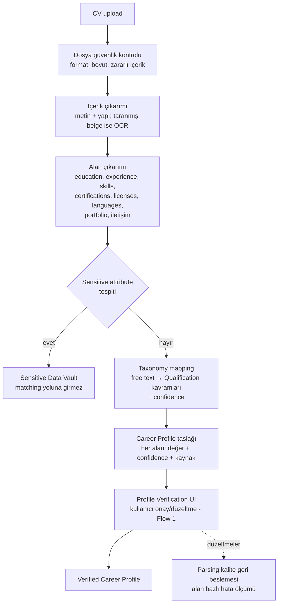

# AI_SYSTEM.md — CV Parsing, Extraction ve AI Bias & Fairness

> **Purpose:** AI destekli anlama katmanlarının sahibi: CV parsing / profile extraction
> flow, ilan requirement extraction'ın AI boyutu ve AI bias & fairness risk yönetimi.
> Matching'in bu çıktıları nasıl kullandığı: [MATCHING_ENGINE.md](MATCHING_ENGINE.md).
> Kavram uzayı: [OCCUPATION_TAXONOMY.md](OCCUPATION_TAXONOMY.md).
> Teknoloji seçimi yapılmamıştır (D-001): "AI bileşeni" burada yöntem-bağımsız
> yetenek olarak tanımlanır (T-009 karşılaştırma çalışmasıyla somutlaşır).

## 1. CV Parsing ve Profile Extraction Flow

### 1.1 Format ve dil kapsama matrisi

"Yaygın formatlar" test edilebilir bir gereksinim değildir; kapsam açıkça tanımlanır.
Kapsam dışı dosya **reddedilir** ve kullanıcı manuel profil yoluna (F-03) yönlendirilir —
sessizce düşük kaliteli parse yapılmaz.

| Girdi | MVP | V1 | İşleme yolu | Kapsam dışıysa davranış |
|---|---|---|---|---|
| PDF (metin katmanlı) | ✅ | ✅ | Native metin çıkarımı | — |
| DOCX | ✖ | ✅ | Native metin çıkarımı | "Şu an PDF destekliyoruz" + manuel yol |
| Taranmış PDF / görüntü (JPG, PNG) | ✖ | ✅ | OCR | OCR yok; manuel yol önerilir |
| Multi-column layout | kısmi | ✅ | Layout-aware çıkarım | Düşük confidence → doğrulama adımında öne çıkarılır |
| Tablo içeren CV | kısmi | ✅ | Tablo çıkarımı | Aynı |
| Türkçe içerik | ✅ | ✅ | — | — |
| Türkçe dışı CV | ✖ | ✅ (F-22) | Dil tespiti + çok dilli parsing | Kullanıcı bilgilendirilir, manuel yol açık |

**MVP kararı: PDF + Türkçe, OCR'sız.** Bu kapsam A-4/T-026 validation sonucuna göre
yeniden değerlendirilebilir. Güvenlik tarafındaki format allowlist'i
([PRIVACY_SECURITY_COMPLIANCE.md](../security/PRIVACY_SECURITY_COMPLIANCE.md) §3) bu
matrisle aynı listedir.

**MVP dil politikası (ilan tarafı):** hedef dil Türkçe. Hedef dil dışı ilanlar ingest
edilir ve `language` işaretlenir, ancak requirement extraction yapılmaz ve first-class
matching'e girmez (limited tier). Requirement sınıflama sinyalleri ("şarttır", "tercih
sebebi") dile bağlıdır; V1 dil genişlemesinde bu kalıp setleri **dil başına yeniden
kurulur** — bu, F-22'nin görünmeyen maliyetidir.

### 1.2 Sensitive alan discard politikası (D-006 güçlendirmesi)

Akıştaki "Sensitive Data Vault" dalı **varsayılan yol değildir.** Şu alanlar tespit
edilirse structured Career Profile'a **aktarılmadan discard edilir**: photo, religion,
ethnicity, marital status, health information, union membership, gender, full birth date.
Yalnızca `{field_type, detected_at}` biçiminde bir **"tespit edildi ve atıldı" meta-kaydı**
tutulur (ölçüm ve denetim için; değer tutulmaz).

Vault'a yazma yalnızca ilgili alan için tanımlı bir `purpose` + `consent_ref` varsa
mümkündür — **MVP'de böyle bir alan yoktur.**

**Tespitin kendisi bir kalite problemidir:** sensitive detection bir AI/heuristik görevdir
ve %100 recall garanti edilemez. Bu yüzden recall ölçülür: içine bilinen sensitive öğeler
yerleştirilmiş sentetik CV'lerle "hiçbiri profile taslağına sızmadı" probe testi
([TEST_STRATEGY.md](../quality/TEST_STRATEGY.md) §4). Kaçan bir alanın serbest metin
üzerinden matching'e sızma riski aynı testin içerik katmanında ele alınır.

### 1.3 Deterministic ↔ AI görev ayrımı

İlan tarafında bu ayrım Normalizer/Extractor bölünmesiyle zaten var; **CV tarafında da
aynı ayrım uygulanır.** AI serbest metni yapılandırır; ardından deterministik bir
son-işleme katmanı çalışır:

| Görev | Yöntem |
|---|---|
| Alan çıkarımı (education, experience, skills, licenses…) | AI extraction |
| Occupation önerisi | AI + taxonomy mapping |
| Tarih normalizasyonu (start/end) | **Deterministik** |
| Deneyim yılı türetme (mezuniyet yılından değil, iş kayıtlarından) | **Deterministik** |
| Ehliyet/belge kategorisi eşleme (kapalı enum + alias) | **Deterministik** |
| Dil seviyesi ölçek normalizasyonu | **Deterministik** |
| Sensitive alan tespiti | AI + kural (kapalı kalıp listeleri) |
| İletişim bilgisi ayrıştırma | **Deterministik** |

Hangi alanın hangi yolla üretildiği `parsing_metadata` içinde işaretlenir; deterministik
alanlar için confidence 1.0 sayılmaz — kural eşleşmesi olup olmadığı ayrı bilgidir.

Kurallar:

- **Onaysız alan matching'e "verified" girmez** (FR-103); unverified alanlar düşük
  confidence ile işlenir.
- **Gate-relevant alanlarda doğrulama zorunludur (D-012):** professional license (ehliyet
  kategorisi dahil), work authorization, yasal zorunlu sertifikalar ve country-specific
  authorization alanları `verified` olmadan hiçbir hard requirement'ı `met` yapamaz;
  `unknown / verification required` üretir. Bu alanlar için doğrulama Flow 1/2'de
  **atlanamaz adımdır**; diğer alanlar atlanabilir. `source_span` zorunluluğu
  halüsinasyonu sınırlar ama **span'li-ama-yanlış-yorumlanmış** çıkarımı engellemez —
  gate koruması bu yüzden doğrulamaya bağlanmıştır, span'e değil.
- **Confidence zorunlu:** her çıkarılan alan `{value, confidence, source_span}` taşır;
  düşük confidence alanlar verification UI'da öne çıkarılır ("bunu kontrol et").
- **Sensitive ayrıştırma parse anında yapılır** (D-006): doğum tarihi, fotoğraf, medeni
  durum, din vb. profile taslağına **aktarılmaz ve discard edilir** (§1.2); kullanıcıya "bu bilgiler
  eşleştirmede kullanılmıyor" bilgisi verilir.
- **Kullanıcı düzeltmeleri ikincil ölçüm sinyalidir.** Birincil ölçü **offline etiketli
  CV korpusudur** (T-006b). Kullanıcı düzeltme oranı yön gösterici bir online sinyaldir
  ama tek başına yanlıdır: (a) kullanıcı fark etmediği hatayı düzeltmez (sessiz kabul),
  (b) "parse hatası düzeltmesi" ile "bilgi güncellemesi" karışır — bu ikisi verification
  adımında yapılan değişiklik / sonraki edit ayrımıyla ayrıştırılır, (c) düşük dijital
  okuryazarlık segmenti daha az düzeltir, bu da parsing'i tam korunması gereken segmentte
  olduğundan iyi gösterir (B-3 kör noktası). Segment bazlı accuracy ölçümü bu yüzden
  offline sete dayanır.
- **Çok dillilik (V1, F-22):** parsing hedef pazar diliyle başlar; dil tespiti +
  dil-bağımsız taxonomy kavramları genişlemeyi taşır.

## 2. Job Requirement Extraction (AI boyutu)

Pipeline'daki yeri [SCRAPING_SYSTEM.md](SCRAPING_SYSTEM.md) (Parser/Extractor);
burada anlama davranışı:

- Serbest ilan metninden requirement adayları çıkarılır ve üç seviyeye ayrılır
  (hard / required / preferred). Ayrım sinyalleri: "şarttır/zorunlu" vs "tercih
  sebebi"; yasal kalıplar (license, belge adları) hard adayıdır.
- Her requirement taxonomy kavramına bağlanmaya çalışılır; bağlanamayan `free_text`
  kalır (semantic eşleşmeye düşer).
- **Asimetrik hata politikası:** birini "hard" sanmak (yanlış eleme) ile "hard"ı
  kaçırmak (yanlış umut) farklı maliyettedir. Kural: hard sınıflaması yüksek confidence
  ister; emin olunmayan şart "required (belirsiz)" işlenir ve explanation'da "ilan
  metninde şart olabilir, kontrol et" dilinde sunulur.
- Structured data (sayfa içi işaretleme, API alanları) her zaman serbest metin
  çıkarımına tercih edilir.

## 3. AI Bileşenlerinin Ortak Kuralları

1. **Evidence zorunluluğu:** AI çıktısı, kaynağını (metin parçası/alan) gösterebilmeli —
   explanation'lar yalnızca evidence'lı iddialar içerir (hallucination sınırı).
2. **Versiyonlama:** parser/extractor/model versiyonları provenance'a işlenir;
   versiyon değişimi golden set regression'ından geçer.
3. **İnsan yedeği — yönlendirme kuralı:** düşük confidence çıktının nereye gideceği
   verinin sahibine göre belirlenir:
   - *Kullanıcının kendi verisi* (CV alanları) → **kullanıcı doğrulaması** (Flow 1/2).
   - *Sistem verisi* (ilan extraction, occupation mapping, source policy) → yalnızca
     D-014'teki altı tetikleyiciden birine giriyorsa **Manual Review**; aksi halde
     otomatik davranış (limited tier, `unknown` requirement, örneklem denetimi).

   AI hiçbir yerde tek karar verici değildir.
4. **Veri minimizasyonu:** AI bileşenlerine yalnızca işleri için gereken alanlar gider;
   CV'nin tamamının harici bir servise gönderilmesi gerekiyorsa bu, privacy
   değerlendirmesinden geçer ([PRIVACY_SECURITY_COMPLIANCE.md](../security/PRIVACY_SECURITY_COMPLIANCE.md)).
   ❓ OPEN-03: harici AI servis kullanımına izin verilecek mi, hangi veri sınıflarıyla? (T-009 önerir, **T-008 doğrulamadan karar `Accepted` olamaz**). Bu soru kapanmadan hiçbir gerçek kullanıcı/CV verisi harici bir AI servisine gönderilemez (R-17).

## 4. AI Bias ve Fairness Risks

Politika sahibi matching tarafında ([MATCHING_ENGINE.md](MATCHING_ENGINE.md) → Fairness
Constraints); burada risklerin sistematik dökümü ve önlemler:

| # | Risk | Nerede doğar | Önlem |
|---|---|---|---|
| B-1 | Sensitive attribute'ın doğrudan kullanımı | Parsing → matching veri yolu | Vault izolasyonu + leakage testi (0 tolerans) |
| B-2 | Proxy bias (mezuniyet yılı=yaş, isim, semt) | Faktör tasarımı | Proxy dikkat listesi; faktör ekleme sürecindeki fairness kontrolü |
| B-3 | Extraction kalitesinin dile/formata göre değişmesi (özenli CV yazan avantajlı, blue-collar CV'leri dezavantajlı) | CV parsing | Segment bazlı parsing accuracy ölçümü; CV'siz manuel yol eş değerli tutulur (F-03) |
| B-4 | İlan metinlerindeki ayrımcı şartların sisteme taşınması | Requirement extraction | D-013: skora girmez, kullanıcıya bilgilendirme + kaynağa yönlendirme; belirsizse Manual Review (❓ OPEN-10: gizleme politikası, T-008) |
| B-5 | Feedback loop'un mevcut kalıpları büyütmesi (bir meslek/segment hep az önerilirse hiç iyileşemez) | Feedback learning | Sistem düzeyi öğrenme anonim + insan onaylı; keşif payı (exploration) korunur; segment kalite dengesi izlenir |
| B-6 | Semantic model'in kültürel/dilsel yanlılığı | Semantic similarity katkısı | Semantic katkının sınırlı ağırlığı (D-003); segment bazlı değerlendirme |
| B-7 | Popüler occupation'lara veri bolluğu, niş mesleklere kalite açığı | Taxonomy + golden set kapsamı | Golden set meslek çeşitliliği şartı; occupation başına kalite raporu |
| B-8 | Career transition önerilerinin gerçekçi olmayan yönlendirmesi | Transition + explanation | Regulated koruması (FR-408); barrier_note zorunluluğu (karşılanmayan **her** typical_hard slot için) |
| B-9 | **Source coverage / freshness bias:** source kapsamı zengin meslek ve bölgeler feed'de yapısal olarak daha çok ve daha taze temsil edilir; freshness re-ranking bunu büyütür | Ingestion kompozisyonu + final ranking | Segment kalite raporuna **occupation başına aktif source sayısı ve medyan freshness** eklenir; freshness'ın sıralama katkısına üst sınır (MATCHING_ENGINE §4.1); yeni source'ta freshness nötr |
| B-10 | **Sensitive detection recall hatası:** kaçan sensitive alan profile taslağına, oradan serbest metin üzerinden semantic kanala sızar | CV parsing → matching | Discard politikası (§1.2) + iki katmanlı leakage testi (alan allowlist'i + içerik probe'u); recall ölçülen bir kalite metriğidir, "0 ihlal" iddiası yalnızca yapısal katman içindir |

**Fairness doğrulama rutini:** her engine/model/parser versiyon değişiminde (1) leakage
testi, (2) golden set segment karşılaştırması, (3) koruma metrikleri
([METRICS.md](../product/METRICS.md) → Fairness) raporlanır; açıklanamayan sapma yayını
bloklar (DEFINITION_OF_DONE ile bağlantılı).
