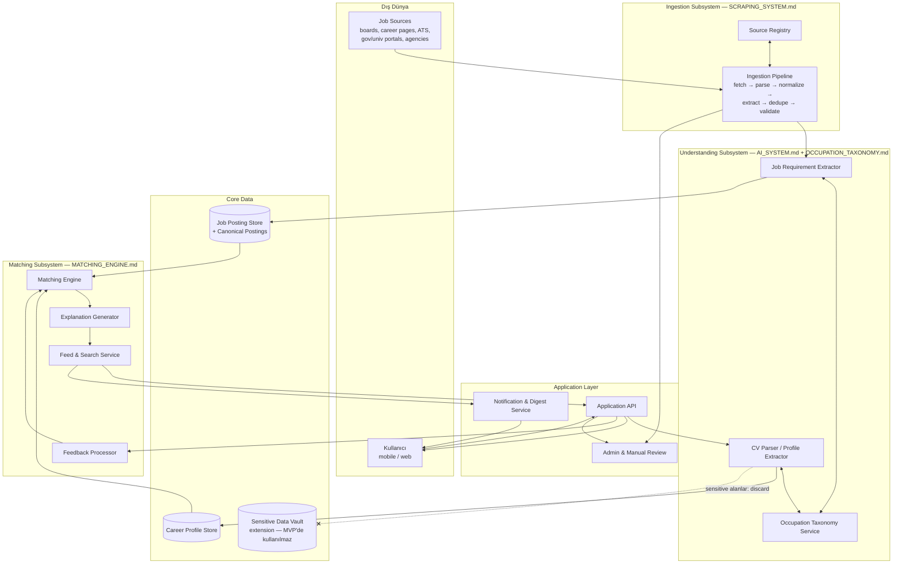

# ARCHITECTURE.md — High-Level System Architecture

> **Purpose:** Sistemin bileşen haritası, sorumluluk sınırları, uçtan uca data flow ve
> failure scenario'larının sahibi. Technology-independent'tır (D-001). Alt sistem
> detayları: [SCRAPING_SYSTEM.md](SCRAPING_SYSTEM.md),
> [MATCHING_ENGINE.md](MATCHING_ENGINE.md), [AI_SYSTEM.md](AI_SYSTEM.md),
> [OCCUPATION_TAXONOMY.md](OCCUPATION_TAXONOMY.md). Veri yapıları:
> [DATA_MODEL.md](DATA_MODEL.md). Bileşenler arası sözleşmeler:
> [API_CONTRACTS.md](API_CONTRACTS.md).

## 1. Mimari İlkeler

1. **Source-independence:** Hiçbir çekirdek bileşen belirli bir source'un yapısını
   bilmez; source'a özgü her şey Source Adapter'da izole edilir.
2. **Pipeline'lar asenkron, kullanıcı deneyimi önceden hesaplanmış:** Ingestion ve
   matching arka planda çalışır; kullanıcıya son hesaplanan sonuç servis edilir. Böylece
   arka plan arızası kullanıcı deneyimini durdurmaz (graceful degradation, NFR-301).
3. **Her katman çıktısını "confidence + provenance" ile üretir:** Extraction, mapping ve
   matching sonuçları hem nereden geldiğini hem de ne kadar güvenilir olduğunu taşır;
   explainability bu sayede sonradan eklenmiş değil, veri yolunun doğal ürünüdür (D-005).
4. **Sensitive veri izolasyonu:** PII ve sensitive attribute'lar, matching veri yoluna
   girmeyen ayrı bir sınırda tutulur (D-006,
   [PRIVACY_SECURITY_COMPLIANCE.md](../security/PRIVACY_SECURITY_COMPLIANCE.md)).
5. **Kavramsal bileşenler ≠ deployment birimleri:** Aşağıdaki bileşenler sorumluluk
   sınırıdır; monolith içi modül veya ayrı servis olarak gerçeklenebilir — bu karar
   stack ADR'sine (T-012) bırakılmıştır.

## 2. Sistem Haritası

## 3. Component Responsibilities

| Bileşen | Sorumluluk | Sorumlu OLMADIĞI |
|---|---|---|
| **Source Registry** | Source kayıtları, policy/permission durumu, health & quality skorları, crawl konfigürasyonu ([SOURCE_REGISTRY.md](SOURCE_REGISTRY.md)) | Fetch/parse işleminin kendisi |
| **Ingestion Pipeline** | Crawl planlama, fetch, parse, normalize (**employer identity resolution dahil**), dedupe, expiration, provenance; source isolation ([SCRAPING_SYSTEM.md](SCRAPING_SYSTEM.md)) | İlan içeriğinin anlamlandırılması (Understanding'e devreder) |
| **Occupation Taxonomy Service** | Occupation'lar, qualification tanımları, Occupation Profile template'leri, transition ilişkileri; mapping sorguları | İlan/CV metni işleme |
| **Job Requirement Extractor** | Normalize ilan metninden structured requirement çıkarımı (Required/Preferred, hard requirements) + confidence | Skorlama |
| **CV Parser / Profile Extractor** | CV → Career Profile alanları + confidence + evidence span; sensitive alanların tespit edilip **discard edilmesi** (D-006, [AI_SYSTEM.md](AI_SYSTEM.md) §1.2) | Kullanıcı onayı olmadan alanı `verified` yapmak; sensitive alanı kalıcılaştırmak |
| **Job Posting Store** | Normalize ilanlar, Canonical Posting'ler, duplicate cluster'lar, freshness/provenance | — |
| **Career Profile Store** | Profil alanları + verification state'leri, preferences | Sensitive attribute saklamak (D-006: hiç saklanmaz) |
| **Sensitive Data Vault** *(extension — MVP'de kullanılmaz)* | Yalnızca tanımlı `purpose` + `consent_ref` olan alanlar için ayrılmış, matching'e kapalı saklama noktası (D-006) | Varsayılan saklama yeri olmak; matching'e veri sağlamak |
| **Matching Engine** | Faktör bazlı hybrid scoring, üç durumlu hard requirement değerlendirmesi, **final ranking hesabı** (Match Score + freshness/kişiselleştirme re-ranking) ve MatchResult invalidation tetikleri ([MATCHING_ENGINE.md](MATCHING_ENGINE.md)) | Açıklama metni üretimi; sıralamanın kullanıcıya sunulması |
| **Explanation Generator** | Faktör sonuçlarından Match Explanation üretimi (karşılanan / karşılanmayan / **değerlendirilemeyen**, legal eligibility uyarıları, coverage limitation notu) | Skoru değiştirmek |
| **Feed & Search Service** | Matching Engine'in ürettiği sıralamayı **uygulayarak** feed'i servis etmek; cache/tazeleme; **keyword + location araması ve filtreleme** (F-08/FR-502) için arama indeksinin sahibi | Skor veya sıralama üretmek (Matching Engine'den alır) |
| **Feedback Processor** | Feedback Signal'ların toplanması, doğrulanması, matching'e uygulanacak biçime çevrilmesi | Ranking'in kendisi |
| **Application API** | Kullanıcıya dönük bütün işlemler: auth, profil CRUD + verification, feed servis, arama (Feed & Search Service'e delege), feedback, data rights | İş mantığı sahipliği |
| **Notification & Digest Service** | Haftalık digest paketleme ve gönderimi, opt-out yönetimi, kullanıcı başına rate limit (D-016) | Eşleşmenin hesaplanması; frekans/kanal seçimi (MVP'de yok) |
| **Admin & Manual Review** | Manual Review Queue, source yönetimi arayüzü, taxonomy bakım işlemleri, kullanıcı raporlarının işlenmesi | — |

## 4. End-to-End Data Flow

### Akış A — İlan hayatı (source → feed)

> **Extraction'ın pipeline'daki tek ve tutarlı konumu (audit ARC-01):** Job Requirement
> Extractor, ingestion pipeline'ının **normalize adımının bir parçası** olarak çalışır —
> ayrı/asenkron bir alt sistem değildir. Job Posting Store'a **iki fazlı yazma** uygulanır:
> pipeline önce iskelet kaydı yazar (adım 3a), extractor aynı kaydın `requirements[]`
> alanını doldurur (adım 3b). Store'a yazma yetkisinin sahibi Ingestion Pipeline'dır;
> Understanding bileşenleri onun içinden çağrılır. Bu sıra
> [SCRAPING_SYSTEM.md](SCRAPING_SYSTEM.md) §2 diyagramı,
> [GLOSSARY.md](../product/GLOSSARY.md) → Ingestion Pipeline tanımı ve
> [API_CONTRACTS.md](API_CONTRACTS.md) C-1/C-3 ile aynıdır.

1. **Schedule:** Crawl Scheduler, Source Registry'deki aktif ve policy-uygun source'lar
   için crawl planlar.
2. **Fetch & Parse:** Adapter fetch eder (rate limit/robots'a uyarak), parser Raw Job
   Document'tan alanları çıkarır.
3. **Normalize & Extract:**
   - *3a. Normalize:* lokasyon, salary, work type, dil, title ve **employer identity**
     çözümlenir → iskelet **Job Posting** yazılır.
   - *3b. Extract:* Job Requirement Extractor + Taxonomy mapping, aynı kaydın
     `requirements[]` ve `occupation_ids[]` alanlarını doldurur (confidence + evidence
     span ile).
4. **Dedupe & Validate:** Duplicate Detector cluster'lar → Canonical Job Posting; Data
   Quality Validator eşik altı kayıtları işaretler (kritik olanlar Manual Review'a düşer —
   D-014 minimal mod).
5. **Store & Index:** Posting store'a yazılır; freshness score atanır; matching **ve
   arama** için indekslenir (arama indeksinin sahibi: Feed & Search Service).
6. **Match & Notify:** Yeni/güncellenen posting'ler ilgili profillere karşı skorlanır;
   eşik üstü eşleşmeler feed'lere ve bildirim kuyruğuna girer.
7. **Expire:** Expiration Detector ilanı düşürür; feed ve digest'lerden çıkar; kayıt
   provenance ile arşivlenir.

### Akış B — Kullanıcı hayatı (kayıt → başvuru)

1. Kayıt → occupation seçimi → CV upload **veya** manuel profil
   ([USER_FLOWS.md](../product/USER_FLOWS.md) Flow 1-2).
2. CV Parser alanları çıkarır; sensitive alanlar vault'a ayrılır; kullanıcı doğrular
   (verification olmadan alan unverified kalır).
3. Feed & Search Service ilk feed'i servis eder; kullanıcı feed'i explanation'larla görür.
4. Kullanıcı feedback verir (save / not interested / applied / report) → Feedback
   Processor → sonraki feed hesaplarına yansır.
5. Başvuru orijinal source'ta yapılır; kullanıcı "applied" işaretler ve durumu takip eder.

## 5. Sınırlar (Boundaries)

- **Trust boundary 1 — Dış içerik:** Source'lardan gelen her şey untrusted input'tur:
  injection, malformed content ve dolandırıcılık ilanı riskine karşı validate edilir
  ([PRIVACY_SECURITY_COMPLIANCE.md](../security/PRIVACY_SECURITY_COMPLIANCE.md) → Security Boundaries).
- **Trust boundary 2 — Kullanıcı içeriği:** CV dosyaları untrusted file input'tur
  (format doğrulama, boyut limiti, zararlı içerik taraması).
- **Privacy boundary — sensitive veri:** Birincil savunma **saklamamaktır** (D-006
  güçlendirmesi): listedeki sensitive alanlar parse anında discard edilir ve hiçbir
  entity'de kalıcılaşmaz. Sensitive Data Vault yalnızca tanımlı purpose + consent olan
  alanlar için bir extension noktasıdır ve **MVP'de kullanılmaz**; vault'tan Matching
  Subsystem'e veri akışı yoktur (NFR-403). Sınır iki katmanlı testle korunur: alan
  allowlist'i (0 tolerans) ve serbest metin/semantic kanal için içerik probe'u
  ([TEST_STRATEGY.md](../quality/TEST_STRATEGY.md) §4).
- **Compliance boundary — Registry:** Ingestion yalnızca Source Registry'de kayıtlı ve
  policy-uygun source'lara gider (FR-202, FR-204).

## 6. Failure Scenarios

Detaylı müdahale adımları: [RUNBOOK.md](../operations/RUNBOOK.md). Riskler:
[RISK_REGISTER.md](../security/RISK_REGISTER.md).

| # | Senaryo | Etki | Tasarım cevabı |
|---|---|---|---|
| FS-1 | Bir source HTML yapısını değiştirdi, parser kırıldı | O source'tan yeni ilan gelmez; yanlış parse riski | Parser success rate alarmı; şema-değişim tespiti (Change Detector); adapter karantinaya alınır, diğer source'lar etkilenmez (Source Isolation) |
| FS-2 | Source erişimi engellendi / policy değişti | Source kapsamı kaybı | Registry'de source `Suspended`; mevcut ilanları TTL ile expire edilir; kapsama açığı raporlanır |
| FS-3 | Duplicate Detector hatalı birleştirme yaptı (farklı ilanlar tek sayıldı) | Kullanıcı ilan kaçırır | Cluster kararları geri alınabilir (merge log); Manual Review ile ayrıştırma; ölçüm: false-merge denetim örneklemi |
| FS-4 | Requirement extraction sistematik hata üretiyor (ör. yeni ilan diliyle) | Yanlış eşleşme/eleme | Confidence düşük extraction'lar hard elemeye dönüşmez (işaretlenir); extraction metrik alarmı; golden set regression |
| FS-5 | Matching Engine arızası / gecikmesi | Feed güncellenmez | Son hesaplanan feed servis edilir; kullanıcıya "güncellik" bilgisi gösterilir (NFR-301) |
| FS-6 | CV parsing servisi arızası | Onboarding'de CV yolu kapanır | Manuel profil yolu (F-03) her zaman açık; CV yeniden işleme kuyruğa alınır |
| FS-7 | Bildirim taşması (hatalı eşik/bug ile spam) | Güven kaybı, opt-out dalgası | Kullanıcı başına bildirim rate limit; digest varsayılanı; kill-switch |
| FS-8 | Dolandırıcılık ilanları bir source'tan sızdı | Kullanıcı zararı, güven kaybı | Quality validation + report akışı (F-25) + source Data Quality Score düşer, eşik altında source askıya alınır |
| FS-9 | Veri ihlali (profil/CV verisi) | Ciddi hukuki ve güven hasarı | Vault ayrımı, encryption, least-privilege, incident response planı ([PRIVACY_SECURITY_COMPLIANCE.md](../security/PRIVACY_SECURITY_COMPLIANCE.md)) |
| FS-10 | Taxonomy hatası (yanlış occupation mapping) yaygın etki | Sistematik alakasız öneri | Mapping confidence; düşük confidence → Manual Review; taxonomy değişiklikleri versiyonlu ve geri alınabilir (rollback prosedürü: RB-5) |
| FS-11 | **Sessiz kapsam çöküşü:** pagination/listing yapısı değişti; crawl ve parse "başarılı" görünürken keşfedilen ilan sayısı düştü | Kullanıcı "ilanlar eksik" algısıyla ayrılır; NFR-101 sessizce ihlal edilir; RB-1 hiç tetiklenmez | Source başına **yield/hacim anomali izlemesi** (keşfedilen ilan sayısı hareketli medyandan sapma) → alert → RB-1; parser success'in sayfa düzeyi yanında **kayıt düzeyi** ölçümü ([OBSERVABILITY.md](../quality/OBSERVABILITY.md)) |
| FS-12 | **Source policy değişimi:** source sonradan login wall/CAPTCHA ekledi veya ToS değiştirdi | Bypass yasağı (D-002) gereği kapsam kaybı; fark edilmezse parser hatası sanılır | Fetch katmanında **login-wall/auth-redirect imza tespiti**; tespit → crawl durur, source `Suspended`, Manual Review (D-014 tetikleyicisi). Bypass **hiçbir koşulda denenmez** |
| FS-13 | **Acil içerik kaldırma talebi** (hukuki talep veya toplu scam tespiti) | TTL bazlı expiration günler sürer; hukuki/güven riski | Source-level **emergency takedown**: `Suspended` + `immediate de-index` → o source'un bütün posting'leri anında feed/arama/digest dışına alınır (arşiv/provenance korunur) — RB-1/RB-9 |

## 7. Deployment Görünümü (kavramsal)

Stack seçilmediği için yalnızca ilke: ingestion (arka plan, ölçeklenen worker havuzu),
matching (arka plan, yeniden hesaplama kuyruklu) ve application API (kullanıcıya dönük,
düşük gecikme) **bağımsız ölçeklenebilir ve bağımsız arızalanabilir** olmalıdır.
Aralarındaki bütün iletişim [API_CONTRACTS.md](API_CONTRACTS.md) sözleşmeleriyle tanımlıdır.
