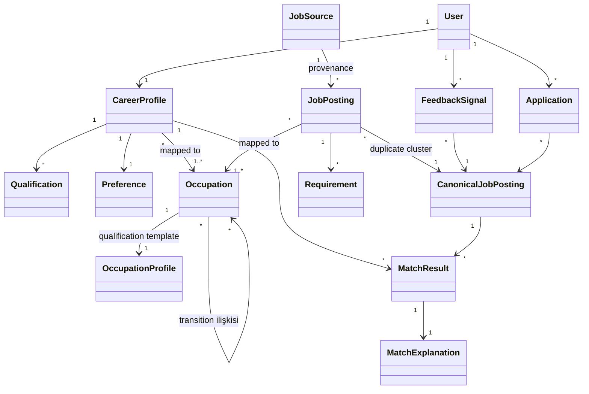

# DOMAIN_MODEL.md — Domain Kavramları ve İlişkileri

> **Purpose:** Domain'in kavramsal modeli: ana kavramlar, aralarındaki ilişkiler ve
> değişmez kurallar (invariants). Terim tanımları [GLOSSARY.md](../product/GLOSSARY.md);
> alan seviyesindeki kavramsal şema [DATA_MODEL.md](DATA_MODEL.md).

## 1. Kavram Haritası

## 2. Kavramların Domain Anlamı

(Tanımlar glossary'de; burada yalnızca modeldeki rolü ve ayrımlar.)

- **User ↔ CareerProfile ayrımı:** User kimlik/hesap kavramıdır; CareerProfile mesleki
  içeriktir. Deletion akışında ikisi farklı işlenir
  ([PRIVACY_SECURITY_COMPLIANCE.md](../security/PRIVACY_SECURITY_COMPLIANCE.md)).
- **Qualification vs Preference:** Qualification "ne yapabildiği"dir (skill, license,
  education…); Preference "ne istediği"dir (lokasyon, maaş, shift). Matching'de farklı
  muamele görürler: qualification eksikliği uygunluğu düşürür, preference uyumsuzluğu
  sıralamayı düşürür ama "uygun değilsin" anlamına gelmez.
- **Requirement (ilan tarafı) ↔ Qualification (kullanıcı tarafı):** Matching, Requirement
  ile Qualification'ı taxonomy üzerinden aynı kavram uzayında buluşturur. Requirement üç
  seviyededir: **Hard Requirement**, **Required Qualification**, **Preferred Qualification**.
- **JobPosting vs CanonicalJobPosting:** JobPosting bir source'tan gelen tekil kayıttır
  (provenance taşır); CanonicalJobPosting kullanıcıya gösterilen birleşik temsilcidir.
  Kullanıcıya dönük her kavram (feed, feedback, application, match) **canonical** ile
  ilişkilenir; provenance sorulduğunda cluster'daki kaynak posting'lere inilir.
- **MatchResult + MatchExplanation:** Skor ile açıklaması ayrılmaz çifttir; explanation
  üretilemeyen skor kullanıcıya sunulmaz (D-005).
- **FeedbackSignal:** Kullanıcı davranışının kaydı; matching kişiselleştirmesinin tek
  meşru kişisel sinyal kaynağıdır.
- **Application:** Kullanıcı beyanlı başvuru kaydı ve durum akışı (A-8).

## 3. Invariants (değişmez kurallar)

1. Her JobPosting tam olarak bir JobSource'a ve bir CanonicalJobPosting'e bağlıdır
   (cluster tek elemanlı olabilir).
2. Registry'de kayıtlı olmayan bir JobSource'tan JobPosting var olamaz (FR-202).
3. Her MatchResult bir MatchExplanation'a sahiptir (D-005).
4. MatchResult hesabına giren hiçbir girdi Sensitive Attribute içeremez (D-006).
5. CareerProfile alanları `unverified` doğar; yalnızca kullanıcı eylemi `verified` yapar
   (FR-103).
6. Expired bir CanonicalJobPosting feed'de, arama sonucunda veya digest'te görünemez
   (FR-207); geçmiş kayıtlarda (saved/applied) "expired" etiketiyle görünür.
7. Occupation'a map edilemeyen JobPosting matching'e girmez; `unmapped` işaretiyle
   Manual Review'a gider (FR-301).
8. Regulated bir Occupation'ın hard license requirement'ı, kullanıcı profilinde o
   license olmadan hiçbir explanation'da "karşılanıyor" gösterilemez (FR-408).

## 4. Bounded Context Önerisi

İleride servis/modül sınırlarına temel olacak dört bağlam:

| Context | Kavramlar | Not |
|---|---|---|
| **Identity & Profile** | User, CareerProfile, Qualification, Preference | Sensitive Data Vault bu bağlamın içinde ayrı sınırdır |
| **Ingestion** | JobSource, JobPosting, CanonicalJobPosting, Requirement | Kaynak dünyasıyla tek temas noktası |
| **Taxonomy** | Occupation, OccupationProfile, transition ilişkileri | Diğer bağlamların ortak dili; yavaş değişir, versiyonludur |
| **Matching & Engagement** | MatchResult, MatchExplanation, FeedbackSignal, Application | Kullanıcı değerinin üretildiği yer |

Bağlamlar arası ilişki kuralları [API_CONTRACTS.md](API_CONTRACTS.md) dosyasındadır.
