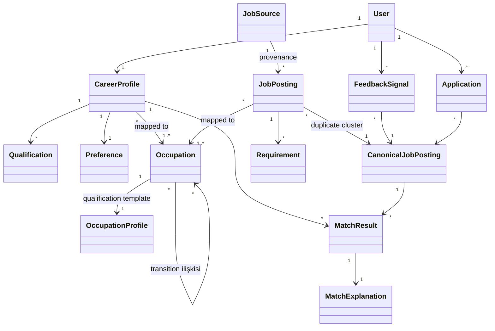

# DOMAIN_MODEL.md — Domain Kavramları ve İlişkileri

> **Purpose:** Domain'in kavramsal modeli: ana kavramlar, aralarındaki ilişkiler ve
> değişmez kurallar (invariants). Terim tanımları [GLOSSARY.md](../product/GLOSSARY.md);
> alan seviyesindeki kavramsal şema [DATA_MODEL.md](DATA_MODEL.md).

## 1. Kavram Haritası

## 2. Kavramların Domain Anlamı

(Tanımlar glossary'de; burada yalnızca modeldeki rolü ve ayrımlar.)

- **User ↔ CareerProfile ayrımı:** User kimlik/hesap kavramıdır; CareerProfile mesleki
  içeriktir. Deletion akışında ikisi farklı işlenir
  ([PRIVACY_SECURITY_COMPLIANCE.md](../security/PRIVACY_SECURITY_COMPLIANCE.md)).
- **Qualification vs Preference:** Qualification "ne yapabildiği"dir (skill, license,
  education…); Preference "ne istediği"dir (lokasyon, maaş, shift). Matching'de farklı
  muamele görürler: qualification eksikliği uygunluğu düşürür, preference uyumsuzluğu
  sıralamayı düşürür ama "uygun değilsin" anlamına gelmez.
- **Requirement (ilan tarafı) ↔ Qualification (kullanıcı tarafı):** Matching, Requirement
  ile Qualification'ı taxonomy üzerinden aynı kavram uzayında buluşturur. Requirement üç
  seviyededir: **Hard Requirement**, **Required Qualification**, **Preferred Qualification**.
- **JobPosting vs CanonicalJobPosting:** JobPosting bir source'tan gelen tekil kayıttır
  (provenance taşır); CanonicalJobPosting kullanıcıya gösterilen birleşik temsilcidir.
  Kullanıcıya dönük her kavram (feed, feedback, application, match) **canonical** ile
  ilişkilenir; provenance sorulduğunda cluster'daki kaynak posting'lere inilir.
- **MatchResult + MatchExplanation:** Skor ile açıklaması ayrılmaz çifttir; explanation
  üretilemeyen skor kullanıcıya sunulmaz (D-005).
- **FeedbackSignal:** Kullanıcı davranışının kaydı; matching kişiselleştirmesinin tek
  meşru kişisel sinyal kaynağıdır.
- **Application:** Kullanıcı beyanlı başvuru kaydı ve durum akışı (A-8).

## 3. Invariants (değişmez kurallar)

1. Her JobPosting tam olarak bir JobSource'a ve bir CanonicalJobPosting'e bağlıdır
   (cluster tek elemanlı olabilir).
2. Registry'de kayıtlı olmayan bir JobSource'tan JobPosting var olamaz (FR-202).
3. Her MatchResult bir MatchExplanation'a sahiptir (D-005).
4. MatchResult hesabına giren hiçbir girdi Sensitive Attribute içeremez (D-006).
5. CareerProfile alanları `unverified` doğar; yalnızca kullanıcı eylemi `user_asserted`
   veya `verified` yapar (FR-103, FR-107).
6. Expired bir CanonicalJobPosting feed'de, arama sonucunda veya digest'te görünemez
   (FR-207); geçmiş kayıtlarda (saved/applied) "expired" etiketiyle görünür.
7. Occupation'a map edilemeyen JobPosting first-class matching'e girmez; `unmapped`
   işaretiyle **limited tier** davranışı alır — listelenir, otomatik recommendation
   üretilmez (FR-301, D-014). Tekil unmapped kayıt Manual Review'a düşmez; sistematik
   unmapped artışı coverage anomalisi olarak izlenir.
8. **Gate invariant'ı (D-012):** Bir hard requirement yalnızca karşılığı olan profil alanı
   `verified` ise `met` gösterilebilir. Gate-relevant alan (professional license — ehliyet
   kategorisi dahil, work authorization, yasal zorunlu sertifika, country-specific
   authorization) yoksa **veya** varsa ama `verified` değilse, sonuç `met` **değildir**;
   yokluk `unmet`, doğrulanmamışlık `unknown / verification required` üretir (FR-408,
   FR-107).
9. **Üç durum invariant'ı (D-011):** Her requirement değerlendirmesi tam olarak bir durum
   taşır: `met`, `unmet` veya `unknown`. Profilde veri bulunmaması **hiçbir koşulda**
   `unmet` üretmez — `unknown` üretir. `unknown` bir hard requirement eleme sebebi
   değildir.
10. **Explanation evidence invariant'ı:** MatchExplanation'daki her iddia en az bir
    `evidence_ref` taşır; evidence'sız iddia üretilemez (D-005).
11. **Legal eligibility invariant'ı (D-013):** `is_legal_eligibility` işaretli bir
    requirement Match Score'a girmez; yalnızca bilgilendirme ve kaynağa yönlendirme
    üretir. Bu değerlendirme için sensitive user data toplanmaz.
12. **Public sector invariant'ı (D-015):** `is_public_sector` olan bir CanonicalJobPosting
    için genel Match Score üretilmez ve "uygunsun" sonucu gösterilmez (FR-410).
13. **Sensitive saklama invariant'ı (D-006 güçlendirmesi):** D-006 listesindeki alanlar
    hiçbir entity'de kalıcılaştırılmaz; yalnızca "tespit edildi ve atıldı" meta-kaydı
    tutulabilir. Sensitive Data Vault'a yazma yalnızca tanımlı `purpose` + `consent_ref`
    varlığında mümkündür ve MVP'de kullanılmaz.

## 4. Bounded Context Önerisi

İleride servis/modül sınırlarına temel olacak dört bağlam:

| Context | Kavramlar | Not |
|---|---|---|
| **Identity & Profile** | User, CareerProfile, Qualification, Preference | Sensitive Data Vault bu bağlamın içinde ayrı sınırdır |
| **Ingestion** | JobSource, JobPosting, CanonicalJobPosting, Requirement | Kaynak dünyasıyla tek temas noktası |
| **Taxonomy** | Occupation, OccupationProfile, transition ilişkileri | Diğer bağlamların ortak dili; yavaş değişir, versiyonludur |
| **Matching & Engagement** | MatchResult, MatchExplanation, FeedbackSignal, Application | Kullanıcı değerinin üretildiği yer |

Bağlamlar arası ilişki kuralları [API_CONTRACTS.md](API_CONTRACTS.md) dosyasındadır.
