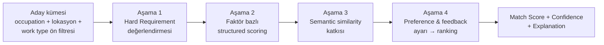
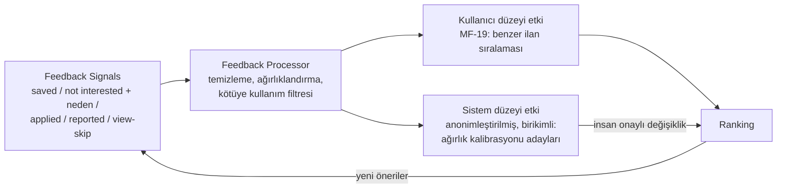

# MATCHING_ENGINE.md — Hybrid Matching, Ranking ve Explainability

> **Purpose:** Career Profile ↔ Job Posting eşleştirmesinin tasarım sahibi: matching
> factor'lar, skorlama/sıralama, fairness kısıtları, explainability ve feedback learning
> loop. Kavram uzayı: [OCCUPATION_TAXONOMY.md](OCCUPATION_TAXONOMY.md). Extraction
> kalitesi ve bias analizi: [AI_SYSTEM.md](AI_SYSTEM.md). Hedef metrikler:
> [METRICS.md](../product/METRICS.md) → Matching Quality.

## 1. Yaklaşım: Hybrid (D-003)

Tek bir semantic similarity skoru yerine dört aşamalı pipeline:

- **Aşama 1 — Hard Requirements (üç durumlu, D-011):** her hard requirement `met`,
  `unmet` veya `unknown` olarak değerlendirilir.
  - `unmet` → ilan ya elenir ya da **açık uyarıyla** işaretlenir (kullanıcı "yine de
    göster" derse veya career transition bağlamında). Sessizce yüksek skor asla verilmez
    (FR-402).
  - `unknown` → **eleme sebebi değildir.** İlan gösterilir, Match Confidence düşer ve
    explanation kullanıcıya hangi bilginin eksik olduğunu, eklerse ne değişeceğini söyler
    (FR-411). `unknown`'ın iki kaynağı vardır: (a) profilde veri yok, (b) gate-relevant
    veri var ama doğrulanmamış (D-012).
  - Extraction confidence düşükse ilan tarafındaki şart "hard eleme" olarak değil
    `unknown` olarak işlenir (FS-4 önlemi).
- **Aşama 2 — Structured scoring:** MVP'de işaretli faktörler (aşağıdaki tablo) kendi alt
  skorunu ve kanıtını (evidence) üretir. Ağırlıklı bileşim → temel skor. `unknown`
  durumundaki bir faktör skoru **düşürmez**; skordan çıkarılır ve confidence'ı düşürür
  (yokluk, olumsuzluk gibi cezalandırılmaz).
- **Aşama 3 — Semantic katkı (sınırlı reranking, D-017):** taxonomy'ye bağlanamayan
  serbest metin qualification'lar ve ilan bağlamı için anlamsal benzerlik. Kısıtlar:
  toplam skora katkısı **en fazla ~%10**; hard gate kararı veremez; structured
  evidence'ın yerine geçemez; low-confidence extraction'da devre dışı kalır; tek başına
  explanation kaynağı olamaz. Explanation'da "genel içerik uyumu" olarak görünür.
  **%10 bir calibration target'tır**, kesin veya evrensel bir değer değildir; golden set
  ölçümüyle yeniden değerlendirilir.
- **Aşama 4 — Kişiselleştirme:** preference uyumu ve Feedback Signal geçmişi sıralamayı
  ayarlar; kullanıcı faktör öncelik ayarları (F-18) V1'de burada uygulanır.

### 1.1 Aday kümesi ön filtresi (semantik)

Ön filtre bir **recall optimizasyonudur, hard filtre değildir.** occupation ve lokasyon
aday havuzunu daraltır; **work type gibi preference alanları aday kümesini daraltmaz** —
uyumsuz work type skoru düşürür ve "tercihinin dışında" etiketiyle erişilebilir kalır.
Bu, GLOSSARY'deki "Preference eksikliği eleme sebebi olmaz" ilkesiyle tutarlıdır.

### 1.2 Yapabilirlik kısıtı ile tercih ayrımı

İki kavram ayrılır ve şemada da ayrı tutulur
([DATA_MODEL.md](DATA_MODEL.md) → Preference):

| Kavram | Örnek | Matching etkisi |
|---|---|---|
| **Capability constraint** (yapabilirlik) | "gece çalışamam", "taşınamam" | Gate olabilir — kullanıcı açıkça beyan ettiyse |
| **Preference** (tercih) | "gündüz isterim", "remote isterim" | Yalnızca sıralama etkisi; eleme üretmez |

MF-14 (shift) yalnızca şu koşulda Gate'e döner: **ilan açık bir hard shift şartı taşıyor
ve kullanıcı o vardiyayı yapamayacağını açıkça beyan etmiş.** Diğer bütün durumlarda
Core faktördür.

## 2. Matching Factors

Her faktör: girdisi, çıktısı (0-1 alt skor + evidence) ve explanation cümlesi
üretebilme şartıyla tanımlanır. "Grup" sütunu skor bileşimindeki rolü gösterir.

**Scope sütunu (D-017):** MVP'de yalnızca `MVP` işaretli faktörler implement edilir.
MVP faktör seti, onaylanan sekiz başlığın bu tabloya düşürülmüş halidir.

| # | Factor | Grup | Scope | Değerlendirdiği |
|---|---|---|---|---|
| MF-01 | Hard requirements | Gate | **MVP** | Yasal/kesin şartlar: zorunlu license, çalışma izni vb. → *hard qualification compatibility* |
| MF-02 | Required qualifications | Core | **MVP** | İlanın zorunlu dediği qualification'ların karşılanma oranı → *hard qualification compatibility* |
| MF-03 | Preferred qualifications | Core | V1 | Tercih sebeplerinin karşılanması |
| MF-04 | Job title compatibility | Core | V1 | Normalize title ↔ kullanıcı geçmiş title'ları. **MF-05'ten farkı:** aynı occupation içindeki rol nüansı/seviye sinyali; occupation eşitliğini MF-05 ölçer (çifte sayım yasak) |
| MF-05 | Occupation compatibility | Core | **MVP** | İlan occupation'ı ↔ kullanıcı occupation'ları + transition yakınlığı → *occupation compatibility* |
| MF-06 | Skill compatibility | Core | **MVP** | Kavram bazlı skill örtüşmesi (level/yıl dikkate alınır) → *skills* |
| MF-07 | Education compatibility | Core | **MVP** | Seviye + alan uyumu (aşırı-nitelik ayrıca işaretlenir) → *education* |
| MF-08 | Experience & seniority | Core | **MVP** | Yıl + rol düzeyi; entry-level kalibrasyonu (bkz. §2.1) → *experience* |
| MF-09 | Professional license | Gate/Core | **MVP** | Kategori/jurisdiction/geçerlilik; regulated'da gate → *license & certification* |
| MF-10 | Certification | Core | **MVP** | Sertifika eşleşmesi (muadilleri taxonomy bilir) → *license & certification* |
| MF-11 | Language requirements | Core | V1 | Dil + seviye. MVP tek dilli olduğundan ayrı faktör değil; **ilan dilinden dil şartı çıkarsanmaz** (yalnızca ilan metni açıkça dil şartı koyuyorsa değerlendirilir) |
| MF-12 | Location & relocation | Core | **MVP** | Mesafe/bölge; relocation_ok; remote ise nötr → *location & work arrangement* |
| MF-13 | Work type (remote/hybrid/on-site) | Preference | **MVP** | Kullanıcı tercihi ↔ ilan → *location & work arrangement* |
| MF-14 | Shift availability | Core/Gate | **MVP** | Vardiya uyumu; Gate'e dönme kuralı §1.2'de → *shift & salary preferences* |
| MF-15 | Salary expectation | Preference | **MVP** | Beklenti ↔ ilan aralığı (ilan açıklamıyorsa nötr + belirtilir) → *shift & salary preferences* |
| MF-16 | Industry experience | Core | V1 | Sektör deneyimi örtüşmesi (normalize sektör sözlüğü gerektirir) |
| MF-17 | Portfolio requirement | Core | V1 | Portfolio isteyen ilanda portfolio varlığı/türü — MVP occupation setinde portfolio-ağırlıklı meslek yok |
| MF-18 | User preferences (diğer) | Preference | V1 | Sektör dışlama, işveren gizleme (employer identity resolution'a bağımlı) |
| MF-19 | User feedback history | Personalization | **MVP** (kural bazlı) | Not interested/saved/applied desenleri; öğrenen katman V1 |
| MF-20 | Semantic similarity | Reranking-sınırlı | **MVP** (≤~%10) | Structured'a bağlanamayan içerik uyumu; kısıtlar §1 Aşama 3 |

**MVP faktör seti (8 başlık ↔ MF eşlemesi):** occupation compatibility (MF-05) · hard
qualification compatibility (MF-01, MF-02) · skills (MF-06) · experience (MF-08) ·
education (MF-07) · license & certification (MF-09, MF-10) · location & work arrangement
(MF-12, MF-13) · shift & salary preferences (MF-14, MF-15). Ek olarak MF-19 kural bazlı
ve MF-20 sınırlı reranking olarak MVP'dedir.

### 2.0 Ağırlık bileşimi

Üç mekanizma vardır ve bileşim sırası şudur:

1. **Taban:** occupation'a göreli ağırlıklar. Ağırlıklar **ilanın occupation'ından**
   türetilir (kullanıcınınkinden değil); kullanıcının birden çok occupation'ı varsa her
   ilan kendi occupation'ının ağırlık setiyle değerlendirilir.
2. **Kullanıcı override'ı (V1, F-18):** taban ağırlıklara sınırlı aralıkta çarpan olarak
   uygulanır. **Gate faktörleri (MF-01, MF-09) override edilemez.**
3. **Feedback ayarı:** yalnızca Personalization katmanında (MF-19); taban ağırlıkları
   değiştirmez. Kullanıcının açık override'ı, feedback'ten çıkarılan örtük tercihi ezer.

Başlangıç ağırlıkları elle kalibre edilir (golden set, T-006/T-006b); öğrenilen ağırlıklar
V1+ konusudur. MVP occupation seti dışındaki occupation'lar için ağırlık kalibrasyonu
yoktur — bkz. §2.2 Cold Start.

### 2.2 Cold start davranışı

| Cold start türü | Davranış |
|---|---|
| **Yeni kullanıcı** (feedback geçmişi yok) | MF-19 nötr; skor tamamen structured faktörlerden gelir. Feed boş kalmaz; kişiselleştirme yokluğu explanation'da belirtilmez (gürültü olur) ama Match Confidence'a etki etmez — structured veri yeterlidir. |
| **Kalibre edilmemiş occupation** (MVP seti dışı) | Occupation'a göreli ağırlık yerine **jenerik varsayılan ağırlık seti** kullanılır; Match Confidence düşürülür ve kullanıcıya **coverage limitation** açıklaması gösterilir (D-008). |
| **Yeni source** (`data_quality_score`, `avg_posting_lifetime` = null) | Freshness ve expiration kararlarında source-bağımlı girdiler nötr kabul edilir; source `Active (limited)` olduğu sürece ilanları feed'e girer ama re-ranking'de freshness bonusu almaz. |
| **Yeni occupation'a geçen kullanıcı** | Önceki occupation'ın feedback'i yeni occupation'a taşınmaz (yanlış sinyal); MF-19 o occupation için sıfırdan başlar. |

### 2.3 MatchResult invalidation

Bir MatchResult şu olaylarda **stale** sayılır ve yeniden hesaplanır:

| Tetik | Kapsam |
|---|---|
| Career Profile veya Preference değişikliği | O kullanıcının bütün MatchResult'ları |
| Gate-relevant alanın doğrulanması (D-012) | O kullanıcının bütün MatchResult'ları (gate durumu değişebilir) |
| `posting_updated` olayı (içerik değişti) | O canonical'a bağlı bütün MatchResult'lar |
| `posting_expired` olayı | O canonical'a bağlı MatchResult'lar geçersizleşir, feed'den düşer |
| `canonical_merged` / `canonical_split` | Etkilenen canonical'lara bağlı MatchResult'lar |
| `engine_version` artışı | Kademeli yeniden hesaplama (arka planda, öncelik: aktif kullanıcılar) |
| `taxonomy_version` değişimi | Etkilenen occupation mapping'lerine bağlı MatchResult'lar |
| Ağırlık kalibrasyonu değişikliği | İlgili occupation'ın MatchResult'ları |

Yeniden hesaplama tamamlanana kadar **son geçerli feed servis edilir** (NFR-301) ve
kullanıcıya feed'in tazelik bilgisi gösterilir. Olay sözleşmeleri:
[API_CONTRACTS.md](API_CONTRACTS.md) → C-1, C-4.

### 2.1 Seniority kalibrasyonu (P6 Emre kuralı)

"X yıl deneyim" çoğu ilanda esnek beklentidir; hard requirement olarak işlenmez
(ilan açıkça yasal şart demedikçe). Eksik yıl skoru düşürür ve explanation'da açıkça
söylenir ("ilan 3 yıl bekliyor, profilinde 1 yıl var"), ama ilan gizlenmez.

## 3. Fairness Constraints (D-006)

- **Yasaklı girdiler (istisnasız):** age/doğum tarihi, gender, photo, ethnicity, religion,
  marital status, sendika üyeliği ve **health information**. Bu alanlar matching feature
  set'ine **hiç girmez** — koşullu istisna yoktur (D-013). Ayrıca bu alanların çoğu hiç
  saklanmaz (D-006 güçlendirmesi); parse anında discard edilir
  ([AI_SYSTEM.md](AI_SYSTEM.md) §1.2).
- **Proxy dikkat listesi:** mezuniyet yılı (yaş proxy'si), isim, fotoğraflı portfolio,
  adres hassasiyeti, **çalışma izni durumu (uyruk proxy'si)**. Kurallar: mezuniyet yılı
  yalnızca deneyim süresine çevrilerek kullanılır; isim hiçbir faktöre girmez; lokasyon
  yalnızca mesafe/bölge uyumu olarak kullanılır; çalışma izni yalnızca ilanın açık yasal
  şartına karşı ikili (var/yok/bilinmiyor) kontrol olarak kullanılır, uyruk sorulmaz.
  Detaylı bias analizi: [AI_SYSTEM.md](AI_SYSTEM.md) → Bias & Fairness.
- **Doğrulama (iki katmanlı):**
  1. *Yapısal katman:* matching'e giren her alan açık bir **allowlist**'e karşı doğrulanır
     (denylist değil — yeni alan varsayılan olarak yasaktır). Burada 0 tolerans geçerlidir.
  2. *İçerik katmanı:* serbest metin girdileri ve semantic kanal için "sensitive tohumlu"
     sentetik profillerle periyodik probe testi; sensitive tespit recall'u ölçülür.
     Buradaki hedef 0 değil, **ölçülen ve izlenen** bir kalite metriğidir.
  Detay: [TEST_STRATEGY.md](../quality/TEST_STRATEGY.md) §4. Ek olarak segment kalite
  dengesi izlenir ([METRICS.md](../product/METRICS.md)).

### 3.1 Legal Eligibility Requirement ≠ Sensitive Attribute (D-013)

İlan tarafındaki "yasal/policy şartı" ile kullanıcı tarafındaki "sensitive attribute"
farklı kavramlardır ve farklı işlenir.

Bir ilanda age, health, military status veya benzeri özel bir şart tespit edilirse:

1. Sistem kullanıcıyı **otomatik olarak uygun veya uygunsuz ilan etmez**; bu şart Match
   Score'a girmez.
2. Şart kullanıcıya **bilgilendirme** olarak gösterilir ("bu ilan X şartı içeriyor") ve
   kullanıcı **orijinal ilanı kontrol etmeye** yönlendirilir.
3. Şartın legal/policy durumu belirsizse kayıt **Manual Review**'a düşer (D-014
   tetikleyicilerinden biri).
4. Bu değerlendirme için **sensitive user data toplanmaz**; otomatik eligibility scoring
   yapılmaz.

> Hangi şartın hangi pazarda yasal olduğu **hukuki görüş gerektirir** (T-008). Bu doküman
> bu konuda confirmed legal fact üretmez. ❓ OPEN-10: ayrımcı olduğu değerlendirilen
> ilanların tamamen gizlenip gizlenmeyeceği hukuki doğrulamaya bağlıdır.

## 4. Score, Confidence ve Sunum (D-005)

- **Match Score:** faktör bileşimi; kullanıcıya **bant + bağlam** olarak sunulur
  (ör. "Güçlü eşleşme"), kesinlik iddiasız. UI metni her zaman skorun bir **tahmin**
  olduğunu, işe alım garantisi olmadığını açık eder (FR-405).
- **Match Confidence (skordan ayrı):** girdi kalitesinden türetilir — **`unknown`
  requirement oranı**, unverified profil alanları, düşük extraction confidence, unmapped
  qualification'lar, eksik ilan alanları, **occupation'ın kalibre edilmemiş olması**
  (D-008 coverage limitation) confidence'ı düşürür. Düşük confidence yüksek skoru
  "emin değiliz, şundan dolayı" notuyla sunar.
- **Match Explanation içeriği** (FR-404, MVP-minimum): neden uygun (en güçlü 3-5 faktör
  kanıtıyla); karşılanan requirements; **karşılanmayan** requirements;
  **değerlendirilemeyen (`unknown`) requirements** — her biri için hangi bilginin eksik
  olduğu ve eklenirse ne değişeceği (FR-411); başvurmaya değer mi değerlendirmesi;
  confidence; freshness; source. *CV iyileştirme önerileri ve eksik qualification'ı
  giderme yol gösterimi V1'dedir (F-20).*
- **`worth_applying_assessment` üretim kuralı:** yalnızca faktör evidence'larından türeyen
  kural tablosuyla üretilir, serbest yorumla değil:

  | Durum | Sunulan değerlendirme |
  |---|---|
  | Bütün hard `met`, required karşılama oranı yüksek | "Güçlü aday görünüyorsun" |
  | Bütün hard `met`, required kısmi | "Başvurulabilir; şu noktalar eksik" |
  | Hard `unknown` var | "Önce şu bilgiyi netleştir" (eksik bilgi adlandırılır) |
  | Hard `unmet` var | "Bu ilan şu şartı istiyor ve profilinde karşılanmıyor" |

  Hiçbir durumda mutlak "başvurma" denmez; kanıta bağlı ifade kullanılır. Match Score
  hiçbir bağlamda işe alınma olasılığı olarak sunulmaz.
- **Explanation üretimi:** faktörlerin evidence çıktılarından şablonlu üretim; serbest
  üretken metin kullanılacaksa bile yalnızca evidence'ta olan iddialar söylenebilir
  (hallucination sınırı — [AI_SYSTEM.md](AI_SYSTEM.md)).

### 4.1 Final Ranking (bu dosya sıralamanın tek sahibidir)

Kullanıcıya gösterilen nihai sıra **Match Score + re-ranking etkenleri** ile üretilir ve
bu hesabın sahibi Matching Engine'dir. Feed & Search Service sıralamayı **uygular**,
üretmez.

| Aşama | Girdi | Not |
|---|---|---|
| 1. Taban sıra | Match Score | §1 pipeline çıktısı |
| 2. Re-ranking: freshness | Freshness Score ([SCRAPING_SYSTEM.md](SCRAPING_SYSTEM.md) §8) | Katkısı sınırlıdır; taze ama alakasız ilanı öne çıkaramaz. **Yeni source'larda (skor null) nötr.** |
| 3. Re-ranking: kişiselleştirme | MF-19 | Kural bazlı (MVP) |
| 4. Kesin kural | Public sector listing-only ilanları (D-015) ayrı bölümde gösterilir; Match Score bandı üretilmez | FR-410 |

Freshness'ın Match Score'un **içinde** bir faktör olmadığına dikkat: skor "bu iş sana ne
kadar uyuyor" sorusunu, freshness "bu ilan ne kadar güncel" sorusunu yanıtlar; ikisi
karıştırılmaz ve explanation'da ayrı gösterilir.

## 5. Career Transition Davranışı (F-21)

- Aday üretimi: taxonomy TransitionLink'leri + transferable qualification örtüşmesi.
- Sunum: "mevcut mesleğine ek olarak şu yakın roller" — mevcut meslek feed'inin yerine
  geçmez, ayrı bölümde.
- **Regulated koruması (FR-408):** hedef occupation regulated ise ve kullanıcının license'ı
  yoksa: öneri "önce şu license gerekir" barrier notu ile verilir; Match Score bandı
  "şartlı" gösterilir; explanation'da eksik açık yazılır. License'sız girilebilecek
  yardımcı roller (ör. hemşirelik yerine hasta bakım destek) varsa onlar önerilir.

## 6. User Feedback Learning Loop (F-17)

- **MVP (kural bazlı):** not interested + neden → aynı neden ekseninde benzer ilanların
  skoru düşer (ör. "lokasyon uzak" → uzak ilanlar geriler); saved/applied → benzer
  ilanlar hafif öne gelir. Etkiler sınırlıdır ve kullanıcıya "tercihlerine göre
  ayarlandı" şeklinde görünür olabilir.
- **V1 (öğrenen katman):** birikmiş feedback ile ağırlık kalibrasyonu — ancak model
  değişiklikleri golden set regression + fairness testinden geçmeden yayına alınmaz;
  feedback döngüsünün bias'ı büyütme riski izlenir ([AI_SYSTEM.md](AI_SYSTEM.md)).
- **Koruma:** feedback yalnızca ilgili kullanıcının kişiselleştirmesini ve anonim
  toplu kalibrasyonu etkiler; bir kullanıcının feedback'i başka kullanıcıya birebir
  sinyal olarak taşınmaz.

## 7. Yeni Matching Factor Ekleme Süreci

1. **Gerekçe:** hangi kullanıcı problemi/persona; hangi metriği iyileştirmesi bekleniyor;
   mevcut faktörlerle neden karşılanamıyor.
2. **Tanım:** girdiler (hangi profil/ilan alanları), alt skor fonksiyonu, evidence
   çıktısı, explanation cümle şablonu, hangi grupta (Gate/Core/Preference/Personalization).
3. **Fairness kontrolü:** girdiler yasaklı/proxy listesine giriyor mu? Sensitive
   attribute leakage testi güncellenir.
4. **Veri kontrolü:** gereken alanlar extraction/profilde var mı, kalitesi yeterli mi
   (yoksa önce extraction işi).
5. **Offline değerlendirme:** golden set'te faktörlü/faktörsüz karşılaştırma; hedef
   metrikte iyileşme, koruma metriklerinde bozulma olmaması.
6. **Kayıt:** faktör bu dosyadaki tabloya eklenir; ağırlık kalibrasyonu notu ve
   DECISIONS.md kaydı; engine_version artar (MatchResult reproducibility).
7. **Kademeli açılış:** mümkünse sınırlı kullanıcı yüzdesiyle online doğrulama.

Faktör kaldırma da aynı yoldan (gerekçe + regression + kayıt) yapılır.
