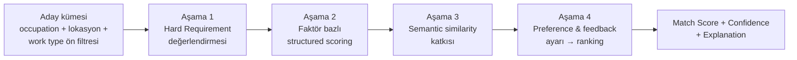
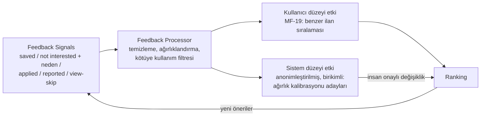

# MATCHING_ENGINE.md — Hybrid Matching, Ranking ve Explainability

> **Purpose:** Career Profile ↔ Job Posting eşleştirmesinin tasarım sahibi: matching
> factor'lar, skorlama/sıralama, fairness kısıtları, explainability ve feedback learning
> loop. Kavram uzayı: [OCCUPATION_TAXONOMY.md](OCCUPATION_TAXONOMY.md). Extraction
> kalitesi ve bias analizi: [AI_SYSTEM.md](AI_SYSTEM.md). Hedef metrikler:
> [METRICS.md](../product/METRICS.md) → Matching Quality.

## 1. Yaklaşım: Hybrid (D-003)

Tek bir semantic similarity skoru yerine dört aşamalı pipeline:

- **Aşama 1 — Hard Requirements:** karşılanmayan hard requirement ilanı ya eler ya da
  (kullanıcı "yine de göster" derse / career transition bağlamında) **açık uyarıyla**
  işaretler. Sessizce yüksek skor asla verilmez (FR-402). Kural: extraction confidence
  düşükse şart "hard eleme" olarak değil "muhtemel eksik" olarak işlenir (FS-4 önlemi).
- **Aşama 2 — Structured scoring:** her faktör (aşağıda) kendi alt skorunu ve kanıtını
  (evidence) üretir. Ağırlıklı bileşim → temel skor.
- **Aşama 3 — Semantic katkı:** taxonomy'ye bağlanamayan serbest metin qualification'lar
  ve ilan bağlamı için anlamsal benzerlik katkısı. Toplam skora katkısı sınırlıdır
  (structured faktörleri ezemez) ve explanation'da "genel içerik uyumu" olarak görünür.
- **Aşama 4 — Kişiselleştirme:** preference uyumu ve Feedback Signal geçmişi sıralamayı
  ayarlar; kullanıcı faktör öncelik ayarları (F-18, V1) burada uygulanır.

## 2. Matching Factors

Her faktör: girdisi, çıktısı (0-1 alt skor + evidence) ve explanation cümlesi
üretebilme şartıyla tanımlanır. "Grup" sütunu skor bileşimindeki rolü gösterir.

| # | Factor | Grup | Değerlendirdiği |
|---|---|---|---|
| MF-01 | Hard requirements | Gate | Yasal/kesin şartlar: zorunlu license, çalışma izni vb. |
| MF-02 | Required qualifications | Core | İlanın zorunlu dediği qualification'ların karşılanma oranı |
| MF-03 | Preferred qualifications | Core | Tercih sebeplerinin karşılanması |
| MF-04 | Job title compatibility | Core | Normalize title ↔ kullanıcı geçmiş title'ları (alias katmanıyla) |
| MF-05 | Occupation compatibility | Core | İlan occupation'ı ↔ kullanıcı occupation'ları + transition yakınlığı |
| MF-06 | Skill compatibility | Core | Kavram bazlı skill örtüşmesi (level/yıl dikkate alınır) |
| MF-07 | Education compatibility | Core | Seviye + alan uyumu (aşırı-nitelik ayrıca işaretlenir) |
| MF-08 | Experience & seniority | Core | Yıl + rol düzeyi; entry-level kalibrasyonu (bkz. §2.1) |
| MF-09 | Professional license | Gate/Core | Kategori/jurisdiction/geçerlilik; regulated'da gate |
| MF-10 | Certification | Core | Sertifika eşleşmesi (muadilleri taxonomy bilir) |
| MF-11 | Language requirements | Core/Gate | Dil + seviye; ilan dili asgari yeterliliği |
| MF-12 | Location & relocation | Core | Mesafe/bölge; relocation_ok; remote ise nötr |
| MF-13 | Work type (remote/hybrid/on-site) | Preference | Kullanıcı tercihi ↔ ilan |
| MF-14 | Shift availability | Core/Gate | Vardiya uyumu (vardiyalı mesleklerde ağırlığı yüksek) |
| MF-15 | Salary expectation | Preference | Beklenti ↔ ilan aralığı (ilan açıklamıyorsa nötr + belirtilir) |
| MF-16 | Industry experience | Core | Sektör deneyimi örtüşmesi |
| MF-17 | Portfolio requirement | Core | Portfolio isteyen ilanda portfolio varlığı/türü |
| MF-18 | User preferences (diğer) | Preference | Sektör dışlama, işveren gizleme vb. |
| MF-19 | User feedback history | Personalization | Not interested/saved/applied desenleri |

Ağırlıklar **occupation'a görelidir** (Occupation Profile'daki importance'lardan
türetilir): şoförde MF-09 ve MF-12, tasarımcıda MF-17, hemşirede MF-09 ve MF-14 ağır
basar. Başlangıç ağırlıkları elle kalibre edilir (golden set, T-006); öğrenilen
ağırlıklar V1+ konusudur.

### 2.1 Seniority kalibrasyonu (P6 Emre kuralı)

"X yıl deneyim" çoğu ilanda esnek beklentidir; hard requirement olarak işlenmez
(ilan açıkça yasal şart demedikçe). Eksik yıl skoru düşürür ve explanation'da açıkça
söylenir ("ilan 3 yıl bekliyor, profilinde 1 yıl var"), ama ilan gizlenmez.

## 3. Fairness Constraints (D-006)

- **Yasaklı girdiler:** age/doğum tarihi, gender, photo, ethnicity, religion, marital
  status, sendika üyeliği, sağlık durumu (işin yasal gerekliliği olmadıkça), ve işle
  doğrudan ilgisi olmayan diğer kişisel özellikler. Bu alanlar matching feature set'ine
  **hiç girmez** (mimari izolasyon: Sensitive Data Vault,
  [ARCHITECTURE.md](ARCHITECTURE.md) → Boundaries).
- **Proxy dikkat listesi:** mezuniyet yılı (yaş proxy'si), isim, fotoğraflı portfolio,
  adres hassasiyeti. Kurallar: mezuniyet yılı yalnızca deneyim süresine çevrilerek
  kullanılır; isim hiçbir faktöre girmez; lokasyon yalnızca mesafe/bölge uyumu olarak
  kullanılır. Detaylı bias analizi: [AI_SYSTEM.md](AI_SYSTEM.md) → Bias & Fairness.
- **Doğrulama:** feature set'te yasaklı alan bulunmadığını doğrulayan otomatik test
  (leakage testi) + segment kalite dengesi izlemesi ([METRICS.md](../product/METRICS.md)).
- **İlan tarafı:** ayrımcı şart içeren ilanlar (ör. yaş/cinsiyet şartı) tespit
  edilirse şart matching'e taşınmaz; ilan işaretlenir ve Manual Review'a düşer.
  ❓ OPEN: bu ilanların tamamen gizlenip gizlenmeyeceği (pazar hukukuna bağlı, T-008).

## 4. Score, Confidence ve Sunum (D-005)

- **Match Score:** faktör bileşimi; kullanıcıya **bant + bağlam** olarak sunulur
  (ör. "Güçlü eşleşme"), kesinlik iddiasız. UI metni her zaman skorun bir **tahmin**
  olduğunu, işe alım garantisi olmadığını açık eder (FR-405).
- **Match Confidence (skordan ayrı):** girdi kalitesinden türetilir — unverified profil
  alanları, düşük extraction confidence, unmapped qualification'lar, eksik ilan alanları
  confidence'ı düşürür. Düşük confidence yüksek skoru "emin değiliz, şundan dolayı"
  notuyla sunar.
- **Match Explanation içeriği** (FR-404): neden uygun (en güçlü 3-5 faktör kanıtıyla);
  karşılanan requirements; eksik requirements (hard/required/preferred ayrımıyla);
  başvurmaya değer mi değerlendirmesi; CV'de neyin öne çıkarılabileceği; eksik
  qualification/certification önerisi; confidence; freshness; source.
- **Explanation üretimi:** faktörlerin evidence çıktılarından şablonlu üretim; serbest
  üretken metin kullanılacaksa bile yalnızca evidence'ta olan iddialar söylenebilir
  (hallucination sınırı — [AI_SYSTEM.md](AI_SYSTEM.md)).

## 5. Career Transition Davranışı (F-21)

- Aday üretimi: taxonomy TransitionLink'leri + transferable qualification örtüşmesi.
- Sunum: "mevcut mesleğine ek olarak şu yakın roller" — mevcut meslek feed'inin yerine
  geçmez, ayrı bölümde.
- **Regulated koruması (FR-408):** hedef occupation regulated ise ve kullanıcının license'ı
  yoksa: öneri "önce şu license gerekir" barrier notu ile verilir; Match Score bandı
  "şartlı" gösterilir; explanation'da eksik açık yazılır. License'sız girilebilecek
  yardımcı roller (ör. hemşirelik yerine hasta bakım destek) varsa onlar önerilir.

## 6. User Feedback Learning Loop (F-17)

- **MVP (kural bazlı):** not interested + neden → aynı neden ekseninde benzer ilanların
  skoru düşer (ör. "lokasyon uzak" → uzak ilanlar geriler); saved/applied → benzer
  ilanlar hafif öne gelir. Etkiler sınırlıdır ve kullanıcıya "tercihlerine göre
  ayarlandı" şeklinde görünür olabilir.
- **V1 (öğrenen katman):** birikmiş feedback ile ağırlık kalibrasyonu — ancak model
  değişiklikleri golden set regression + fairness testinden geçmeden yayına alınmaz;
  feedback döngüsünün bias'ı büyütme riski izlenir ([AI_SYSTEM.md](AI_SYSTEM.md)).
- **Koruma:** feedback yalnızca ilgili kullanıcının kişiselleştirmesini ve anonim
  toplu kalibrasyonu etkiler; bir kullanıcının feedback'i başka kullanıcıya birebir
  sinyal olarak taşınmaz.

## 7. Yeni Matching Factor Ekleme Süreci

1. **Gerekçe:** hangi kullanıcı problemi/persona; hangi metriği iyileştirmesi bekleniyor;
   mevcut faktörlerle neden karşılanamıyor.
2. **Tanım:** girdiler (hangi profil/ilan alanları), alt skor fonksiyonu, evidence
   çıktısı, explanation cümle şablonu, hangi grupta (Gate/Core/Preference/Personalization).
3. **Fairness kontrolü:** girdiler yasaklı/proxy listesine giriyor mu? Sensitive
   attribute leakage testi güncellenir.
4. **Veri kontrolü:** gereken alanlar extraction/profilde var mı, kalitesi yeterli mi
   (yoksa önce extraction işi).
5. **Offline değerlendirme:** golden set'te faktörlü/faktörsüz karşılaştırma; hedef
   metrikte iyileşme, koruma metriklerinde bozulma olmaması.
6. **Kayıt:** faktör bu dosyadaki tabloya eklenir; ağırlık kalibrasyonu notu ve
   DECISIONS.md kaydı; engine_version artar (MatchResult reproducibility).
7. **Kademeli açılış:** mümkünse sınırlı kullanıcı yüzdesiyle online doğrulama.

Faktör kaldırma da aynı yoldan (gerekçe + regression + kayıt) yapılır.
