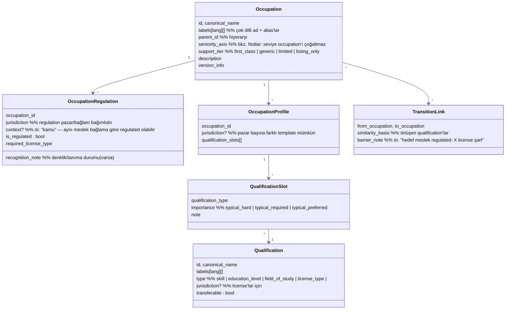

# OCCUPATION_TAXONOMY.md — Occupation Taxonomy Tasarımı

> **Purpose:** Mesleklerin, qualification'ların ve aralarındaki ilişkilerin merkezi
> modelinin sahibi. Taxonomy; ilan anlama, CV anlama, matching ve career transition'ın
> ortak dilidir. Matching'in taxonomy'yi nasıl kullandığı:
> [MATCHING_ENGINE.md](MATCHING_ENGINE.md). Extraction'ın taxonomy'ye mapping süreci:
> [AI_SYSTEM.md](AI_SYSTEM.md).

## 1. Neden Merkezi Taxonomy?

Keyword matching, "hemşire" ile "nurse"ü, "şoför" ile "sürücü"yü, C# ile C'yi ayırt
edemez; meslek-spesifik yapıları (ehliyet kategorisi, branş, vardiya) hiç anlayamaz.
Taxonomy üç işi görür:

1. **Ortak kavram uzayı:** İlan tarafındaki Requirement ile kullanıcı tarafındaki
   Qualification aynı kavram kimliğinde buluşur.
2. **Meslek-spesifik şablon:** Her Occupation, hangi qualification türlerinin önemli
   olduğunu bilen bir Occupation Profile taşır — hemşirede license ve department,
   şoförde ehliyet kategorisi ve bölge, tasarımcıda portfolio.
3. **Geçiş haritası:** Occupation'lar arası yakınlık ve transferable skill örtüşmesi,
   Career Transition önerilerinin (F-21) temelidir.

## 2. Temel Karar: Standarttan Türet (D-004)

Çekirdek olarak açık bir occupation standardı (ESCO veya O*NET) alınır; üzerine
platform extension katmanı eklenir. ❓ OPEN-02: standart seçimi (T-004); §2.1'deki bağımlılık matrisi bu kararın zorunlu girdisidir.

| Katman | İçerik | Değişim hızı |
|---|---|---|
| **Core (standarttan)** | Occupation hiyerarşisi, standart skill kavramları, occupation-skill ilişkileri | Yavaş; standart sürümüyle güncellenir |
| **Country extension (TR)** | TR'ye özgü meslekler, license/certification türleri (ör. SRC, psikoteknik, SMMM ruhsatı), lokasyon yapısı, denklik kuralları, **Türkçe label'lar** | Kontrollü süreçle (bkz. §6) |
| **Platform extension** | Occupation Profile template'leri, qualification slot'ları, transition ilişkileri | Kontrollü süreçle |
| **Alias katmanı** | Piyasa dilindeki title varyantları → occupation eşlemeleri | Sık; §6.1 governance'ına tabi |

> **D-009 kuralı:** Country extension katmanı **değiştirilebilir bir katmandır**; core
> katman TR varsayımı taşımaz. İkinci bir pazar eklendiğinde core ve platform extension
> aynı kalır, yalnızca yeni bir country extension eklenir.

### 2.1 Özellik → standart bağımlılığı (T-004'ün zorunlu girdisi)

Model, iki standardın özelliklerinin **birleşimini varsaymamalıdır**. Aşağıdaki matris
T-004 kararının girdisidir; hangi standart seçilirse seçilsin **açıkta kalan iş** vardır:

| Model özelliği | ESCO'da | O*NET'te | Seçilmezse platformun yapacağı iş |
|---|---|---|---|
| Occupation hiyerarşisi | var | var | — |
| Occupation–skill ilişkileri | var | var | — |
| Çok dilli label (AB dilleri) | var | yok (EN) | O*NET seçilirse tam çeviri |
| **Türkçe label** | **yok** | **yok** | **Her iki durumda da platform üretir** (country extension) |
| Occupation transition / related occupations | zayıf | var (Related Occupations) | ESCO seçilirse elle kürasyon (§6 adım 5) |
| TR license/qualification türleri | yok | yok | Her iki durumda da country extension |

**Sonuç:** Türkçe label üretimi ve TR-özgü qualification'lar standart seçiminden
bağımsız olarak platformun işidir; standart seçimi yalnızca transition verisi ve
çeviri yükünü değiştirir. A-6 assumption'ı bu ayrıma göre okunmalıdır.

## 2.5 Support Tiers (D-008)

Platform vision universal'dır; ancak MVP'de her occupation aynı derinlikte desteklenmez.

| Tier | Kapsam | Davranış |
|---|---|---|
| **First-class** | MVP'nin 6 occupation'ı (§4.1) | Occupation-specific template + soru seti + kalibre ağırlık + golden set kapsamı |
| **Generic** | Core taxonomy'de karşılığı olan diğer occupation'lar | Jenerik varsayılan ağırlıklarla matching yapılır; **Match Confidence düşürülür** ve kullanıcıya **coverage limitation** açıklaması gösterilir |
| **Limited** | Mapping'i düşük confidence'lı veya kapasite aşımı nedeniyle kısıtlanan occupation'lar (D-014) | İlanlar listelenir, otomatik recommendation üretilmez |
| **Listing-only** | Public sector ilanları (D-015) | Listelenir + kaynağa yönlendirilir; Match Score üretilmez |

Kullanıcı hiçbir tier'da engellenmez; tier yalnızca **ne kadar iddialı** davranıldığını
belirler. Coverage limitation metni kullanıcıya sade dille sunulur ("mesleğin için
ayrıntılı eşleştirme henüz hazır değil; sonuçlar genel değerlendirmeye dayanıyor").

## 3. Model

Notlar:
- **Regulation jurisdiction-bağlamlıdır, bool değil.** Aynı meslek bir pazarda regulated,
  başkasında değil olabilir; hatta aynı pazarda bağlama göre değişebilir (ör. öğretmenlik
  kamuda regulated). Bu yüzden `regulated: bool` yerine `OccupationRegulation`
  (occupation × jurisdiction × context) kullanılır. Tutarlılık kuralı (testlenir):
  `is_regulated = true` olan her kayıt için ilgili OccupationProfile'da en az bir
  `license_type` slotu `typical_hard` olmalıdır. MVP'de yalnızca `jurisdiction: TR`
  kayıtları doldurulur.
- **Denklik (recognition):** Profil license'ının jurisdiction'ı ile ilanın jurisdiction'ı
  farklıysa MVP kuralı: **tam eşleşme aranır**, denklik otomatik varsayılmaz. Eşleşmeyen
  durumda sonuç `unmet` değil `unknown`'dır ve explanation "denklik durumunu
  doğrulayamıyoruz, kaynaktan kontrol et" der. Otomatik denklik eşlemesi V1 konusudur.
- **Seniority occupation'ı çoğaltmaz.** "Senior X" ayrı bir occupation node'u **açılmaz**;
  seviye bilgisi (a) ilan tarafında `requirements[].min_years` / `level` alanlarında,
  (b) kullanıcı tarafında `work_experience[]` süresinden türetilerek taşınır. Alias
  eşlemesi title'daki seviye ifadesini ("kıdemli", "senior") ayırıp occupation'a değil
  seniority sinyaline yazar.
- **Specialization kuralı.** "ICU nurse" gibi uzmanlıklar için: core standartta ayrı node
  olarak varsa o node kullanılır; yoksa **yeni node açılmaz** — parent occupation
  (Nurse) + ayırt edici qualification (department/equipment/certification) ile temsil
  edilir. Yeni child node yalnızca §6 sürecinde ve "kendine özgü license veya qualification
  template gerektiriyor" gerekçesiyle açılır.
- **Occupation Profile "şablon"dur, ilanın yerine geçmez:** gerçek requirement'lar her
  ilandan çıkarılır. **Template default'u tek başına gate üretmez** — istisnası aşağıdaki
  kuraldır.
- **Hard requirement'ın kaynağı (iki kaynak, tek kural):**
  1. *Occupation seviyesinden gelen gate:* `OccupationRegulation.is_regulated = true` ise
     ilgili license gate'i **ilan metninde yazmasa da** uygulanır (regulated dürüstlüğü,
     FR-408). Bu, kullanıcıyı korumak içindir.
  2. *İlan seviyesinden gelen gate:* extraction'ın `kind: hard` olarak çıkardığı şartlar.
  3. *Regulated olmayan `typical_hard` slot'ları* **asla eleme üretmez**; yalnızca
     explanation'da "ilan belirtmemiş ama bu meslekte genelde beklenir" notu üretir.
  Her requirement'ın kaynağı MatchResult evidence'ında işaretlenir
  (`posting_extracted` / `occupation_rule`) ki explanation dürüst kalsın.
- **Versiyonlama:** taxonomy değişiklikleri versiyonludur; MatchResult `taxonomy_version`
  taşır (reproducibility ve invalidation — FS-10, MATCHING_ENGINE §2.3).

## 4. Occupation Profile'lar

### 4.1 MVP first-class seti (D-008)

Üç cluster, altı occupation. Cluster'lar extraction desenlerini paylaştığı için seçildi
(aynı cluster içindeki occupation'lar benzer qualification yapısına sahiptir).

| Cluster | Occupation | typical_hard | typical_required | typical_preferred |
|---|---|---|---|---|
| **Logistics & Operations** | Driver | Driving license + kategori (TR: ör. C/CE/D); mesleki yeterlilik belgeleri (TR: SRC), psikoteknik — *TR extension* | Rota/bölge deneyimi, araç tipi deneyimi | Tehlikeli madde belgesi, esnek vardiya |
| | Warehouse Worker | — | Depo/stok sistemi deneyimi, fiziksel iş uygunluğu beyanı | Forklift operatör belgesi, vardiya esnekliği |
| **Office & Commercial** | Accountant | *(TR: ruhsat gerektiren roller `OccupationRegulation` ile işaretlenir)* | Muhasebe eğitimi, muhasebe yazılımı, mevzuat bilgisi | Certification (TR: SMMM ruhsatı), İngilizce |
| | Sales Representative | — | Sektör deneyimi, iletişim becerisi | Driving license (B), yabancı dil, CRM deneyimi |
| **Healthcare** | Nurse | Hemşirelik lisansı/tescili (jurisdiction: TR) — **regulated** | Hemşirelik eğitimi, departman deneyimi | Yoğun bakım vb. ek sertifikalar, yabancı dil |
| | Health Technician | Alanına göre yetki belgesi (jurisdiction: TR) — **regulated (alan bazlı)** | Meslek yüksekokulu/teknisyenlik eğitimi, cihaz deneyimi | Ek cihaz sertifikaları, vardiya uygunluğu |

> Bu tablo bir **taslaktır**; T-005'te her occupation için tam Occupation Profile
> doldurulacak ve TR-özgü belge adları hukuki/pazar doğrulamasından (T-003, T-008)
> geçtikten sonra kesinleşecektir. Belge adları burada **örnek** olarak verilmiştir,
> confirmed legal fact değildir.

### 4.2 First-class olmayan occupation örnekleri (generic tier)

Aşağıdakiler MVP'de first-class **değildir** ama kullanıcı bunları seçebilir ve generic
matching alır (Support Tiers, §2.5): Teacher, UX Designer, Software Engineer, CNC
Technician, Chef, Receptionist ve core taxonomy'deki diğer bütün occupation'lar. Bunlar
için template doldurulmaz, ağırlık kalibre edilmez ve coverage limitation açıklaması
gösterilir.

## 5. Mapping Kullanımı

- **İlan → Occupation:** title + içerik sinyalleriyle, alias katmanı üzerinden; sonuç
  `{occupation_id, confidence}`. Düşük confidence → `unmapped`: ilan **limited tier**
  davranışıyla listelenir (otomatik recommendation üretilmez), Manual Review'a
  **düşmez** (D-014 minimal mod). Toplu/sistematik unmapped artışı ise coverage
  anomalisi olarak izlenir.
- **Profil → Occupation:** kullanıcı seçimi esastır (F-05); CV'den öneri yapılır ama
  kullanıcı onaylar.
- **Requirement/Qualification → kavram:** extraction serbest metni Qualification
  kavramlarına bağlamaya çalışır; bağlanamayan `free_text` olarak kalır ve semantic
  matching'e düşer (hybrid yaklaşımın "yumuşak" tarafı, D-003).

## 6. Yeni Occupation Ekleme Süreci

1. **Talep:** kaynaklar — kullanıcının occupation bulamaması (Flow 1 fallback),
   extraction'ın sık `unmapped` üretmesi, source coverage analizi.
2. **Standart kontrolü:** kavram core standartta var mı? Varsa etkinleştir + alias ekle
   (yeni node açılmaz).
3. **Tanım:** yoksa extension'da yeni Occupation: canonical name, label'lar (TR dahil),
   parent (hiyerarşide yeri), `support_tier`. Specialization ise §3'teki kural uygulanır
   (yeni node yerine parent + qualification).
4. **Regulation değerlendirmesi:** ilgili jurisdiction/context için `OccupationRegulation`
   kaydı — regulated ise hangi license, hangi hukuki kaynağa dayanarak. *Hukuki dayanak
   doğrulanmamışsa kayıt `is_regulated` olarak işaretlenmez; açık soru olarak T-008'e
   bağlanır.*
5. **Occupation Profile:** qualification slot'ları doldurulur; gerekiyorsa yeni
   Qualification kavramları da aynı süreçle eklenir.
6. **Transition ilişkileri:** en yakın 3-5 occupation ile TransitionLink değerlendirilir.
   `barrier_note` **yalnızca regulated hedefler için değil**, hedefte kullanıcının
   karşılamadığı **her `typical_hard` slot** için zorunludur (ör. zorunlu vocational
   certification, portfolio şartı).
7. **Review + versiyon:** ikinci göz onayı — tek kişilik ekipte
   [DEFINITION_OF_DONE.md](../../DEFINITION_OF_DONE.md)'daki "insan veya ikinci agent"
   formülü geçerlidir; taxonomy minor/major versiyon notu; PROGRESS kaydı.
8. **Doğrulama:** alias'larla örnek ilanların mapping testi; ilgili golden set
   örneklerinin güncellenmesi ([TEST_STRATEGY.md](../quality/TEST_STRATEGY.md)).

Silme yerine `deprecated` + yönlendirme (eski profillerin kırılmaması için).

### 6.1 Alias Governance

Alias katmanı hızlı büyür ve occupation mapping accuracy hedefinin (≥90%) ana
belirleyicisidir; bu yüzden ayrı bir yönetişimi vardır:

- **Kaynaklar:** extraction geri beslemesi (sık görülen eşlenemeyen title'lar), kullanıcı
  seçimleri, elle ekleme.
- **Onay:** otomatik **öneri** üretilir, yayına **insan onayıyla** girer. MVP hacminde
  (6 occupation) bu makuldür.
- **Çok anlamlı title'lar** ("mühendis", "danışman", "operatör" gibi tek başına birden çok
  occupation'a gidebilenler): tekil eşleme yapılmaz; **aday listesi + confidence** döner
  ve düşük confidence limited tier davranışını tetikler.
- **Versiyonlama:** alias seti occupation node'larından **ayrı ve hafif** versiyonlanır;
  her alias eklemesi taxonomy major versiyonunu artırmaz (aksi halde "sık değişim" ile
  "reproducibility" çelişirdi). MatchResult'taki `taxonomy_version` node versiyonunu
  izler.
- **Ölçüm:** occupation mapping accuracy kırılımında "alias kaynaklı hata" ayrı etiketlenir
  ([METRICS.md](../product/METRICS.md)).

## 7. MVP Kapsamı

MVP'de **3 cluster / 6 first-class Occupation Profile** (§4.1, D-008; T-005'te
doldurulacak). Taxonomy'nin core katmanı bütünüyle yüklenir — mapping herkes için
çalışır — ancak zengin profile/transition verisi ve ağırlık kalibrasyonu yalnızca bu altı
occupation'da derinleştirilir. Kapsam dışı occupation'a düşen kullanıcı **generic tier**
davranışı alır: jenerik varsayılan ağırlıklarla eşleştirilir, Match Confidence düşürülür
ve **coverage limitation açıklaması** gösterilir (§2.5).

Golden set'in meslek dağılımı bu altı occupation üzerinden kurulur; white-collar dışı
oranı doğal olarak yarıyı aşar (Driver, Warehouse Worker, Nurse, Health Technician),
bu da [TEST_STRATEGY.md](../quality/TEST_STRATEGY.md) §3'teki çeşitlilik şartını
çarpıklık yaratmadan karşılar.
