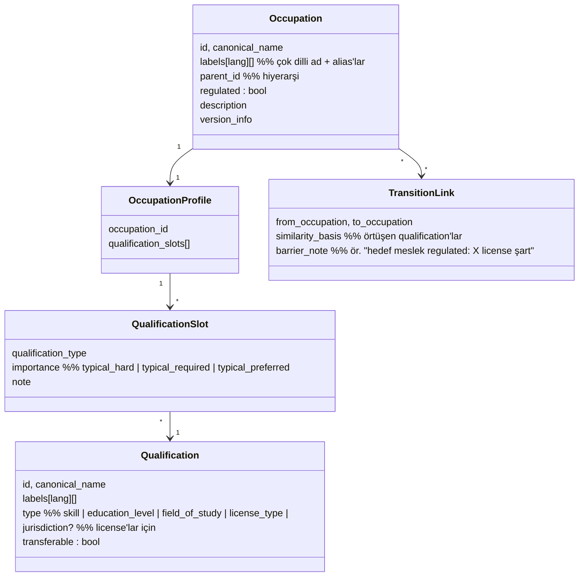

# OCCUPATION_TAXONOMY.md — Occupation Taxonomy Tasarımı

> **Purpose:** Mesleklerin, qualification'ların ve aralarındaki ilişkilerin merkezi
> modelinin sahibi. Taxonomy; ilan anlama, CV anlama, matching ve career transition'ın
> ortak dilidir. Matching'in taxonomy'yi nasıl kullandığı:
> [MATCHING_ENGINE.md](MATCHING_ENGINE.md). Extraction'ın taxonomy'ye mapping süreci:
> [AI_SYSTEM.md](AI_SYSTEM.md).

## 1. Neden Merkezi Taxonomy?

Keyword matching, "hemşire" ile "nurse"ü, "şoför" ile "sürücü"yü, C# ile C'yi ayırt
edemez; meslek-spesifik yapıları (ehliyet kategorisi, branş, vardiya) hiç anlayamaz.
Taxonomy üç işi görür:

1. **Ortak kavram uzayı:** İlan tarafındaki Requirement ile kullanıcı tarafındaki
   Qualification aynı kavram kimliğinde buluşur.
2. **Meslek-spesifik şablon:** Her Occupation, hangi qualification türlerinin önemli
   olduğunu bilen bir Occupation Profile taşır — hemşirede license ve department,
   şoförde ehliyet kategorisi ve bölge, tasarımcıda portfolio.
3. **Geçiş haritası:** Occupation'lar arası yakınlık ve transferable skill örtüşmesi,
   Career Transition önerilerinin (F-21) temelidir.

## 2. Temel Karar: Standarttan Türet (D-004)

Çekirdek olarak açık bir occupation standardı (ESCO veya O*NET) alınır; üzerine
platform extension katmanı eklenir. ❓ OPEN: standart seçimi hedef pazara bağlı (T-004).

| Katman | İçerik | Değişim hızı |
|---|---|---|
| **Core (standarttan)** | Occupation hiyerarşisi, standart skill kavramları, occupation-skill ilişkileri, çok dilli etiketler | Yavaş; standart sürümüyle güncellenir |
| **Extension (platform)** | Lokal meslekler, lokal license/certification türleri (ör. SRC, SMMM), pazar-özgü qualification'lar, Occupation Profile template'leri | Kontrollü süreçle (bkz. §6) |
| **Alias katmanı** | Piyasa dilindeki title varyantları → occupation eşlemeleri ("yazılım geliştirici", "software developer", "SW engineer") | Sık; extraction geri beslemesiyle büyür |

## 3. Model

Notlar:
- **`regulated` bayrağı** occupation seviyesindedir; regulated occupation'ın profile'ında
  en az bir `license_type` slotu `typical_hard` olmalıdır (tutarlılık kuralı, testlenir).
- **Occupation Profile "şablon"dur, ilanın yerine geçmez:** gerçek requirement'lar her
  ilandan çıkarılır; profile, extraction'a rehber (ne aranacağını bilme) ve eksik veri
  durumunda makul varsayılan sağlar.
- **Versiyonlama:** taxonomy değişiklikleri versiyonludur; matching sonuçları hangi
  taxonomy versiyonuyla üretildiğini bilir (reproducibility, FS-10).

## 4. Örnek Occupation Profile'lar (şablonun kullanımı)

| Occupation | typical_hard | typical_required | typical_preferred |
|---|---|---|---|
| Registered Nurse (regulated) | Nursing license (jurisdiction) | Nursing degree, department experience | Ek sertifikalar (ör. yoğun bakım), yabancı dil |
| Heavy Vehicle Driver | Driving license kategori (ör. CE), zorunlu mesleki belgeler | Rota/bölge deneyimi | Tehlikeli madde belgesi, esnek vardiya |
| Accountant | (pazar bağlı: ruhsat gerektiren roller regulated işaretlenir) | Accounting degree/software, mevzuat bilgisi | Certification (ör. SMMM/CPA), İngilizce |
| Teacher (regulated, kamu) | Teaching certificate, branş yeterliliği | Degree, deneyim | Ek pedagojik sertifikalar |
| UX Designer | — | Portfolio, design tools | Sektör deneyimi, design system deneyimi |
| Sales Representative | — | Sektör deneyimi, iletişim | Driving license, yabancı dil |
| CNC Technician | — (bazı belgeler pazara göre hard olabilir) | Vocational certification, makine bilgisi | Vardiya uygunluğu, ek makine tipleri |
| Software Engineer | — | Programming languages/frameworks, project experience | System knowledge, domain deneyimi |

## 5. Mapping Kullanımı

- **İlan → Occupation:** title + içerik sinyalleriyle, alias katmanı üzerinden; sonuç
  `{occupation_id, confidence}`. Düşük confidence → `unmapped`, Manual Review
  (invariant #7).
- **Profil → Occupation:** kullanıcı seçimi esastır (F-05); CV'den öneri yapılır ama
  kullanıcı onaylar.
- **Requirement/Qualification → kavram:** extraction serbest metni Qualification
  kavramlarına bağlamaya çalışır; bağlanamayan `free_text` olarak kalır ve semantic
  matching'e düşer (hybrid yaklaşımın "yumuşak" tarafı, D-003).

## 6. Yeni Occupation Ekleme Süreci

1. **Talep:** kaynaklar — kullanıcının occupation bulamaması (Flow 1 fallback),
   extraction'ın sık `unmapped` üretmesi, source coverage analizi.
2. **Standart kontrolü:** kavram core standartta var mı? Varsa etkinleştir + alias ekle
   (yeni node açılmaz).
3. **Tanım:** yoksa extension'da yeni Occupation: canonical name, çok dilli label'lar,
   parent (hiyerarşide yeri), `regulated` değerlendirmesi (regulated ise hangi license —
   hukuki kaynak notuyla).
4. **Occupation Profile:** qualification slot'ları doldurulur; gerekiyorsa yeni
   Qualification kavramları da aynı süreçle eklenir.
5. **Transition ilişkileri:** en yakın 3-5 occupation ile TransitionLink değerlendirilir
   (özellikle barrier_note — regulated hedefler için zorunlu).
6. **Review + versiyon:** ikinci göz onayı; taxonomy minor/major versiyon notu;
   [CHANGELOG.md](../../CHANGELOG.md) kaydı.
7. **Doğrulama:** alias'larla örnek ilanların mapping testi; ilgili golden set
   örneklerinin güncellenmesi ([TEST_STRATEGY.md](../quality/TEST_STRATEGY.md)).

Silme yerine `deprecated` + yönlendirme (eski profillerin kırılmaması için).

## 7. MVP Kapsamı

MVP'de 8-10 birinci sınıf Occupation Profile (T-005; en az 3'ü white-collar dışı).
Taxonomy'nin core katmanı bütünüyle yüklenir (mapping herkes için çalışır); ancak
zengin profile/transition verisi MVP occupation'larında derinleştirilir. Kapsam dışı
occupation'a düşen kullanıcı, jenerik faktörlerle (skill/location/preference) hizmet
alır ve bu durum Match Confidence'a yansır.
