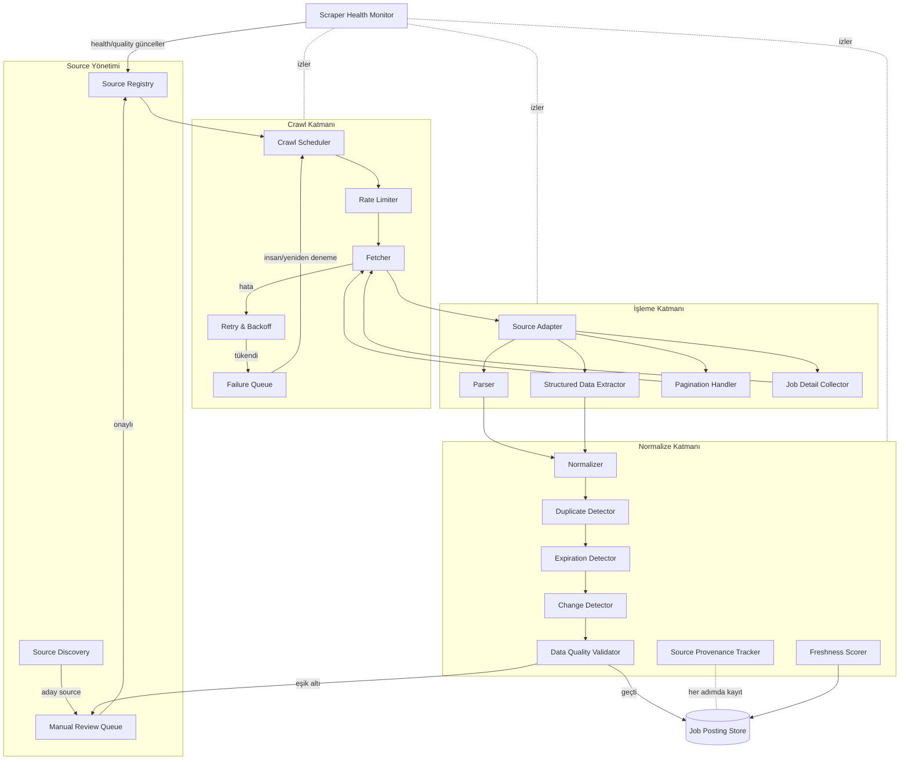

# SCRAPING_SYSTEM.md — Job Ingestion ve Scraping Architecture

> **Purpose:** İlanların dış dünyadan toplanıp normalize edilmiş Job Posting'lere
> dönüşene kadarki bütün sürecin sahibi: bileşenler, compliance kuralları, data quality,
> duplicate/expiration/freshness stratejileri ve yeni adapter ekleme süreci.
> Source kayıt şeması: [SOURCE_REGISTRY.md](SOURCE_REGISTRY.md). Genel mimari bağlam:
> [ARCHITECTURE.md](ARCHITECTURE.md). Compliance politikasının hukuki çerçevesi:
> [PRIVACY_SECURITY_COMPLIANCE.md](../security/PRIVACY_SECURITY_COMPLIANCE.md).

## 1. Tasarım İlkeleri

1. **Compliance-first (D-002):** Scraping *yapılabilirlik* ile *izin* ayrı sorulardır.
   Teknik olarak erişilebilir her kaynak toplanabilir demek değildir. Login wall,
   CAPTCHA veya bot-detection **bypass edilmez**; robots kuralları, source Terms ve rate
   limit'lere uyulur. Policy-uygun olmayan source Registry'de `Rejected/Suspended`
   statüsüyle kalır ve crawl edilmez.
2. **Source-independence:** Çekirdek pipeline hiçbir source'un yapısını bilmez.
   Source'a özgü bilgi (URL desenleri, HTML/JSON yapısı, pagination) yalnızca o
   source'un adapter'ında yaşar. Yapısal çeşitlilik desteklenir: API, feed (RSS/sitemap),
   structured data (ör. sayfa içi yapılandırılmış ilan işaretlemeleri) ve HTML parsing
   aynı pipeline'a çıkar.
3. **Source Isolation & graceful degradation:** Bir adapter'ın hatası, yasaklanması veya
   yavaşlaması diğer source'ları ve pipeline'ın kalanını etkilemez. Her source bağımsız
   planlanır, bağımsız arızalanır, bağımsız karantinaya alınır.
4. **Her kayıt provenance taşır:** Hangi source, hangi URL, ne zaman, hangi
   adapter/parser versiyonu.
5. **Nazik komşuluk:** Varsayılan davranış muhafazakârdır: düşük istek hızı, backoff,
   cache'e saygı, tanımlanabilir user-agent, gece-gündüz yük dengelemesi. Amaç kaynak
   sitelere yük bindirmemektir.

## 2. Bileşen Mimarisi

## 3. Bileşen Sorumlulukları

| Bileşen | Sorumluluk |
|---|---|
| **Source Registry** | Source kayıtları, policy/permission, crawl config, health & quality durumu ([SOURCE_REGISTRY.md](SOURCE_REGISTRY.md)) |
| **Source Discovery** | Yeni aday source'ların bulunması (manuel öneri, kullanıcı önerisi, sistematik tarama). Adaylar **doğrudan crawl edilmez**; policy değerlendirmesi için Manual Review Queue'ya gider |
| **Source Adapter** | Bir source için: giriş noktaları, listing→detail gezinme kuralı, alan çıkarma konfigürasyonu, source'a özgü tuhaflıklar. Adapter'lar versiyonludur |
| **Crawl Scheduler** | Registry'deki aktif source'lar için crawl planı: frekans (source'un yayın temposuna göre adaptif), öncelik, yük dağılımı |
| **Fetcher** | HTTP erişimi: robots kurallarını okuma ve uygulama, tanımlanabilir user-agent, timeout, cache/conditional request kullanımı |
| **Rate Limiter** | Source başına istek hızı sınırı (registry'deki değer; bilinmiyorsa muhafazakâr varsayılan). İhlal = compliance bug'ı, metrik sıfır toleranslı ([METRICS.md](../product/METRICS.md)) |
| **Retry & Backoff** | Geçici hatalarda exponential backoff + jitter; kalıcı hata sınıflandırması (4xx policy sinyalleri retry edilmez, source review'a düşer) |
| **Failure Queue** | Retry'ı tükenen işlerin bekletildiği kuyruk; yaş metriği izlenir; insan kararına veya koşul düzelince yeniden planlamaya gider |
| **Parser** | Raw Job Document'tan alan çıkarma (adapter konfigürasyonuna göre) |
| **Structured Data Extractor** | Sayfa içi yapılandırılmış veri (schema.org JobPosting benzeri işaretlemeler, embedded JSON) çıkarımı — HTML parsing'e göre her zaman önceliklidir (daha dayanıklı) |
| **Pagination Handler** | Listing sayfalarında sayfalama/sonsuz kaydırma desenlerinin gezilmesi; döngü ve tekrar koruması |
| **Job Detail Collector** | Listing'de bulunan ilanların detay sayfalarının toplanması; değişmemiş detaylar için gereksiz fetch'ten kaçınma (Change Detector ile) |
| **Normalizer** | Alanların platform şemasına dönüştürülmesi: lokasyon çözümleme, salary/period normalizasyonu, work type/employment type eşleme, dil tespiti, title normalizasyonu |
| **Duplicate Detector** | Aynı gerçek ilanın kopyalarını cluster'lama (strateji: §6) |
| **Expiration Detector** | İlanın yayından kalktığının tespiti (strateji: §7) |
| **Change Detector** | Var olan ilanın içeriğinin değişip değişmediği (content fingerprint); değişiklikte yeniden extraction tetiklenir |
| **Data Quality Validator** | Zorunlu alan kontrolü, tutarlılık kuralları (ör. salary aralığı mantıklı mı), spam/dolandırıcılık işaretleri; eşik altı → Manual Review Queue |
| **Source Provenance Tracker** | Her kayda fetch zamanı, URL, adapter/parser/extractor versiyonlarının işlenmesi |
| **Freshness Scorer** | Freshness Score hesabı (strateji: §8) |
| **Scraper Health Monitor** | Source başına success rate'ler, lag'ler, hata sınıfları; Registry'deki health/quality alanlarını günceller; alert üretir ([OBSERVABILITY.md](../quality/OBSERVABILITY.md)) |
| **Manual Review Queue** | Policy değerlendirmesi bekleyen aday source'lar, eşik altı kayıtlar, kullanıcı raporları (F-25) için insan inceleme kuyruğu |

## 4. Compliant Source Strategy

Her source, ingest edilmeden önce şu değerlendirmeden geçer (sonuçlar Source Record'a işlenir):

1. **Access method tercihi (sırayla):** resmi API → resmi feed (RSS/sitemap) →
   sayfa içi structured data → HTML parsing. Daha üst seçenek varken alttakine inilmez.
2. **Policy kontrolü:** robots kuralları hangi path'lere izin veriyor? Terms of Service
   otomatik erişim hakkında ne diyor? İlan içeriğinin yeniden gösterimi konusunda kısıt
   var mı? Sonuç: `Allowed / Conditional / Rejected` + gerekçe.
3. **Erişim gereksinimi:** login, CAPTCHA veya bot-detection arkasındaki içerik kapsam
   dışıdır (bypass yok — D-002). Kısmi açık içerik varsa yalnızca açık kısım değerlendirilir.
4. **Rate limit:** kaynak belirtiyorsa o; belirtmiyorsa muhafazakâr varsayılan.
5. **İşbirliği fırsatı:** uygun kaynaklarla (özellikle government/university portalları
   ve ATS sağlayıcıları) resmi feed/API anlaşması her zaman tercih edilen yoldur.

**Gri alan kuralı:** Policy belirsizse source `Conditional` işaretlenir ve insan kararı
olmadan crawl başlamaz. ❓ OPEN: Conditional source'lar için karar rubriği hukuki
doğrulamayla (T-008) netleşecek — riskler:
[PRIVACY_SECURITY_COMPLIANCE.md](../security/PRIVACY_SECURITY_COMPLIANCE.md) → Source Policy.

## 5. Data Quality Strategy

- **Katmanlı doğrulama:** (1) şema doğrulama (zorunlu alanlar: title, location veya
  remote, source URL, ilan metni), (2) değer doğrulama (tarih/salary makul mü,
  lokasyon çözümlenebildi mi), (3) içerik doğrulama (spam/scam işaretleri, boş/şablon
  ilanlar).
- **Eşik davranışı:** Kritik alan eksik → posting `under_review`, feed'e çıkmaz. Kritik
  olmayan eksik → yayınlanır, eksiklik Match Confidence'a yansır.
- **Source seviyesi:** Kayıt kalitesi source'un **Data Quality Score**'una toplanır;
  eşik altına düşen source otomatik askıya alınır ve Manual Review'a düşer.
- **İnsan döngüsü:** Kullanıcı raporları (F-25) ve örneklem denetimleri (rastgele seçilen
  kayıtların elle kontrolü) kalite ölçümünü besler.
- Hedef değerler: [METRICS.md](../product/METRICS.md) → Scraper Health.

## 6. Duplicate Detection Strategy

Aynı ilan birden çok source'ta (şirket sayfası + 2 job board + agency) görünebilir.

- **Aşama 1 — kesin eşleşme:** aynı source içinde source_posting_ref; source'lar arası
  aynı canonical URL / aynı ATS ilan kimliği.
- **Aşama 2 — güçlü sinyal bileşimi:** normalize (employer + title + location) anahtar
  bloklaması içinde içerik benzerliği (metin fingerprint/near-duplicate karşılaştırma).
  Eşik üstü → aynı cluster.
- **Aşama 3 — belirsiz bölge:** orta benzerlik → `possible duplicate` işareti, Manual
  Review örneklemine girer; kullanıcıya ayrı gösterilmeye devam eder (yanlış birleştirme,
  ilan kaçırtmaktan daha maliyetli — FS-3).
- **Cluster davranışı:** temsilci üye = en taze + en yüksek kaliteli kayıt; agency kopyası
  yerine işverenin kendi ilanı tercih edilir. Merge kararları loglanır ve geri alınabilir.
- **Zaman boyutu:** expired olup yeniden yayınlanan ilan (repost) yeni cluster açar ama
  `repost_of` ilişkisiyle bağlanır (kullanıcı "bunu daha önce gördüm" bilgisini alabilir).

## 7. Expiration Detection Strategy

Sinyaller (birleşik değerlendirilir):

1. **Açık sinyal:** ilanda son başvuru tarihi geçti; source API/feed "closed" diyor.
2. **Yokluk sinyali:** ilan detail URL'i 404/410 veya listing'de artık görünmüyor
   (art arda N crawl).
3. **İçerik sinyali:** sayfa "ilan kapandı" kalıbına döndü (adapter'a özgü desen).
4. **Yaş sinyali:** source'un tipik ilan ömrü aşıldı (source bazlı öğrenilen TTL) →
   önce `stale` işaretlenir, doğrulama crawl'ı öne çekilir.
5. **Kullanıcı sinyali:** F-25 raporu → doğrulama tetiklenir.

Davranış: expired → feed/arama/digest'ten çıkar (NFR-102), saved/applied listelerinde
"expired" etiketiyle kalır, kayıt arşivlenir (retention:
[PRIVACY_SECURITY_COMPLIANCE.md](../security/PRIVACY_SECURITY_COMPLIANCE.md)).

## 8. Job Freshness Strategy

- **Freshness Score girdileri:** posted_at (varsa), platformun ilk görme zamanı,
  son başarılı doğrulama (`last_verified_at`), source'un güncelleme temposu ve source'un
  genel güvenilirliği.
- **Kullanımı:** (1) feed sıralamasında pozitif faktör, (2) kullanıcıya "X gün önce
  yayınlandı / son doğrulama Y" şeklinde gösterim (F-24), (3) digest'e girme şartı,
  (4) doğrulama crawl'larının önceliklendirilmesi (eskiyen ilan önce doğrulanır).
- **Dürüstlük kuralı:** posted_at bilinmiyorsa "yayın tarihi bilinmiyor, ilk görülme: …"
  denir; tahmin, gerçek tarih gibi sunulmaz.

## 9. Yeni Source Adapter Ekleme Süreci

Her yeni source şu adımlardan geçer (Definition of Done bağlantılı):

1. **Aday kaydı:** Source Discovery veya öneri → [SOURCE_REGISTRY.md](SOURCE_REGISTRY.md)
   template'i ile ön kayıt (`Candidate`).
2. **Policy değerlendirmesi:** §4'teki compliant source değerlendirmesi doldurulur.
   Sonuç `Rejected` ise süreç biter, kayıt gerekçesiyle saklanır. İnsan onayı zorunludur.
3. **Access method seçimi:** API/feed/structured-data/HTML sırasıyla en üst uygun yöntem.
4. **Adapter geliştirme:** listing girişleri, pagination deseni, detail toplama, alan
   eşlemeleri; adapter versiyonlanır.
5. **Fixture'lı test:** source'tan alınan örnek sayfalar fixture olarak kaydedilir;
   parser bu fixture'larla test edilir ([TEST_STRATEGY.md](../quality/TEST_STRATEGY.md)).
   Canlı test düşük hacimli ve rate-limit'li yapılır.
6. **Kalite provası:** örneklem kayıtlar elle doğrulanır (alan doğruluğu, occupation
   mapping); Data Quality Score başlangıç değeri hesaplanır.
7. **Kademeli açılış:** `Active (limited)` → tam frekans. Health Monitor ilk hafta
   yakın izlemede.
8. **Kayıt güncelleme:** Registry'de status `Active`; parser version, crawl config ve
   sorumlu kişi işlenir.

Adapter'ın kaldırılması/askıya alınması da Registry üzerinden yapılır; source
`Suspended` olduğunda mevcut ilanları normal expiration akışıyla düşer.

## 10. Ölçek Notları

- Crawl frekansı source başına adaptiftir: çok ilan üreten board'lar sık, durağan
  kurumsal sayfalar seyrek.
- Pipeline aşamaları kuyruklarla ayrışır; her aşama bağımsız ölçeklenir (NFR-203).
- Fetch katmanı toplam ve source-başına eşzamanlılık sınırı uygular; bir source'un
  yavaşlığı havuzu bloklamaz (Source Isolation).
