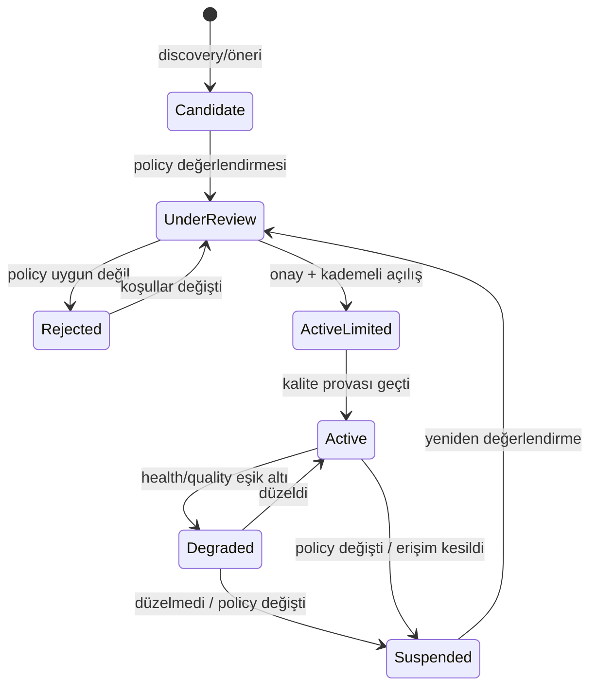

# SOURCE_REGISTRY.md — Source Registry Tasarımı ve Source Record Template

> **Purpose:** Source Registry'nin veri şemasının ve source yaşam döngüsünün sahibi.
> Registry'nin pipeline içindeki rolü ve yeni source ekleme süreci:
> [SCRAPING_SYSTEM.md](SCRAPING_SYSTEM.md). Policy değerlendirme çerçevesinin hukuki
> boyutu: [PRIVACY_SECURITY_COMPLIANCE.md](../security/PRIVACY_SECURITY_COMPLIANCE.md).

## 1. Registry'nin Rolü

Source Registry, sistemin dış dünya ile bütün ilişkisinin **tek kontrol noktasıdır**:

- Kayıtsız source'tan ingestion yapılamaz (FR-202, invariant #2).
- Policy kararları (Allowed/Conditional/Rejected) burada saklanır ve denetlenebilir.
- Health ve quality skorları burada güncellenir; otomatik askıya alma buradan tetiklenir.
- Crawl Scheduler planını buradaki config'lerden üretir.

## 2. Source Lifecycle



Kural: `Rejected` ve `Suspended` kayıtlar silinmez — gerekçe ve tarihçe, aynı source'un
yanlışlıkla yeniden eklenmesini önler.

## 3. Source Record Template

Yeni source kaydında doldurulacak şablon (örnek değerlerle):

```yaml
# --- Kimlik ---
source_id: src-xxxx
source_name: "Örnek İş Portalı"
source_type: job_board            # job_board | company_career_page | ats_page |
                                  # recruitment_agency | government_portal |
                                  # university_portal | sector_specific
base_url: "https://ornek-portal.example"
coverage:
  geography: ["TR"]               # kapsadığı bölge(ler)
  sectors: ["genel"]              # veya sektör listesi
  occupations_note: "tüm meslekler; blue-collar ağırlıklı"
languages: ["tr"]

# --- Erişim ---
access_method: structured_data    # api | feed | structured_data | html
api_availability: none            # official | partner_only | none
authentication_requirement: none  # none | api_key | oauth | login_wall
public_or_restricted: public      # public | partially_restricted | restricted
rate_limit:
  declared: null                  # kaynak açıkça belirtiyorsa
  applied: "muhafazakâr varsayılan; ör. tekil istek, saniyeler arası bekleme"

# --- Policy (insan onayı zorunlu) ---
robots_rules_summary: "ilan sayfalarına izinli; arama sonuç sayfaları disallow"
terms_summary: "otomatik erişim açıkça yasaklanmamış; içerik yeniden yayın kısıtı belirsiz"
scraping_permission: conditional  # allowed | conditional | rejected
policy_risk: medium               # low | medium | high + gerekçe
policy_risk_note: "içerik gösterim kısıtı belirsiz; özet + source'a link ile gösterim"
policy_reviewed_by: "—"
policy_reviewed_at: "—"
reevaluation_due: "policy_reviewed_at + 6 ay"

# --- Operasyon ---
status: candidate                 # bkz. lifecycle
adapter_version: null
parser_version: null
crawl_config:
  frequency: "günlük"             # adaptif; scheduler ayarlar
  entry_points: ["/ilanlar"]
  pagination_pattern: "sayfa parametresi"
owner: "—"                        # sorumlu kişi/rol

# --- Sağlık & Kalite (sistem günceller) ---
last_successful_crawl: null
current_health: unknown           # healthy | degraded | failing | unknown
failure_count_7d: 0
data_quality_score: null          # 0-1; formülün sahibi METRICS.md → Ölçüm Tanımları
field_accuracy: null              # "veri var ama yanlış" boyutu; kullanıcı raporları +
                                  # örneklem denetiminden beslenir
job_freshness_score: null         # source'un tipik güncellik davranışı
avg_posting_lifetime: null        # öğrenilen TTL (expiration için)
postings_discovered_7d: null      # yield anomali izlemesi için (FS-11)
access_change_detected_at: null   # login wall/CAPTCHA imzası tespit edildiyse (FS-12)
notes: ""
```

**Cold start notu:** Yeni bir source'ta `data_quality_score`, `job_freshness_score` ve
`avg_posting_lifetime` `null` başlar. Bu değerler dolana kadar: freshness re-ranking'de
nötr kabul edilir, expiration için source-bağımsız varsayılan yaş eşiği kullanılır ve
source `Active (limited)` statüsünde yakın izlemede kalır
([MATCHING_ENGINE.md](MATCHING_ENGINE.md) §2.2).

**Otomatik durum geçiş eşikleri** (tek yerde tanımlı — METRICS ile tutarlı):
`data_quality_score < 0.6` → `Degraded`; `< 0.5` → `Suspended` + Manual Review.
Hedef değer (≥0.8) bir başarı çizgisidir, müdahale eşiği değildir.

## 4. Alan Kuralları

- **Kimlik + Erişim + Policy** alanları insan tarafından doldurulur/onaylanır;
  **Sağlık & Kalite** alanlarını Scraper Health Monitor günceller — elle oynanmaz.
- `scraping_permission` ile `access_method` birbirinden bağımsız değerlendirilir:
  teknik olarak kolay erişilebilir bir source policy nedeniyle `rejected` olabilir
  (yapılabilirlik ≠ izin).
- `policy_risk: high` olan source ancak açık yazılı izin/anlaşma ile `allowed` olur.
- Her policy kararının `reevaluation_due` tarihi vardır; source Terms değişebilir.
- `authentication_requirement: login_wall` olan içerik kapsam dışıdır (D-002);
  kayıt yine tutulur (ileride resmi API/anlaşma fırsatı için).

## 5. Registry'den Türeyen Görünümler

- **Coverage raporu:** hangi bölge/sektör/meslek grubunda kaç aktif source var —
  kapsama açıklarının görünürlüğü (R-01 riskinin takibi).
- **Compliance denetim görünümü:** bütün Conditional/High-risk source'lar ve
  yeniden değerlendirme tarihleri.
- **Health dashboard:** [OBSERVABILITY.md](../quality/OBSERVABILITY.md) → Scraper Health
  bölümünün source-bazlı kaynağı.
