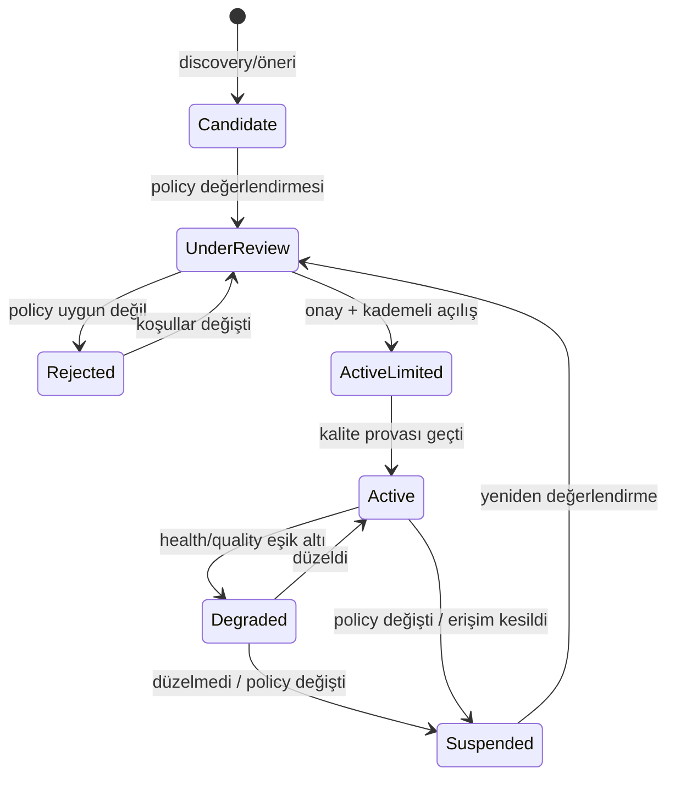

# SOURCE_REGISTRY.md — Source Registry Tasarımı ve Source Record Template

> **Purpose:** Source Registry'nin veri şemasının ve source yaşam döngüsünün sahibi.
> Registry'nin pipeline içindeki rolü ve yeni source ekleme süreci:
> [SCRAPING_SYSTEM.md](SCRAPING_SYSTEM.md). Policy değerlendirme çerçevesinin hukuki
> boyutu: [PRIVACY_SECURITY_COMPLIANCE.md](../security/PRIVACY_SECURITY_COMPLIANCE.md).

## 1. Registry'nin Rolü

Source Registry, sistemin dış dünya ile bütün ilişkisinin **tek kontrol noktasıdır**:

- Kayıtsız source'tan ingestion yapılamaz (FR-202, invariant #2).
- Policy kararları (Allowed/Conditional/Rejected) burada saklanır ve denetlenebilir.
- Health ve quality skorları burada güncellenir; otomatik askıya alma buradan tetiklenir.
- Crawl Scheduler planını buradaki config'lerden üretir.

## 2. Source Lifecycle



Kural: `Rejected` ve `Suspended` kayıtlar silinmez — gerekçe ve tarihçe, aynı source'un
yanlışlıkla yeniden eklenmesini önler.

## 3. Source Record Template

Yeni source kaydında doldurulacak şablon (örnek değerlerle):

```yaml
# --- Kimlik ---
source_id: src-xxxx
source_name: "Örnek İş Portalı"
source_type: job_board            # job_board | company_career_page | ats_page |
                                  # recruitment_agency | government_portal |
                                  # university_portal | sector_specific
base_url: "https://ornek-portal.example"
coverage:
  geography: ["TR"]               # kapsadığı bölge(ler)
  sectors: ["genel"]              # veya sektör listesi
  occupations_note: "tüm meslekler; blue-collar ağırlıklı"
languages: ["tr"]

# --- Erişim ---
access_method: structured_data    # api | feed | structured_data | html | unknown
api_availability: none            # official | partner_only | none | unknown
authentication_requirement: none  # none | api_key | oauth | login_wall | unknown
public_or_restricted: public      # public | partially_restricted | restricted | unknown
rate_limit:
  declared: null                  # kaynak açıkça belirtiyorsa
  applied: "muhafazakâr varsayılan; ör. tekil istek, saniyeler arası bekleme"

# --- Policy (insan onayı zorunlu) ---
robots_rules_summary: "ilan sayfalarına izinli; arama sonuç sayfaları disallow"
terms_summary: "otomatik erişim açıkça yasaklanmamış; içerik yeniden yayın kısıtı belirsiz"
scraping_permission: conditional  # allowed | conditional | rejected | unknown
policy_risk: medium               # low | medium | high | unknown + gerekçe
policy_risk_note: "içerik gösterim kısıtı belirsiz; özet + source'a link ile gösterim"
policy_reviewed_by: "—"
policy_reviewed_at: "—"
reevaluation_due: "policy_reviewed_at + 6 ay"

# --- Operasyon ---
status: candidate                 # bkz. lifecycle
adapter_version: null
parser_version: null
crawl_config:
  frequency: "günlük"             # adaptif; scheduler ayarlar
  entry_points: ["/ilanlar"]
  pagination_pattern: "sayfa parametresi"
owner: "—"                        # sorumlu kişi/rol

# --- Sağlık & Kalite (sistem günceller) ---
last_successful_crawl: null
current_health: unknown           # healthy | degraded | failing | unknown
failure_count_7d: 0
data_quality_score: null          # 0-1; formülün sahibi METRICS.md → Ölçüm Tanımları
field_accuracy: null              # "veri var ama yanlış" boyutu; kullanıcı raporları +
                                  # örneklem denetiminden beslenir
job_freshness_score: null         # source'un tipik güncellik davranışı
avg_posting_lifetime: null        # öğrenilen TTL (expiration için)
postings_discovered_7d: null      # yield anomali izlemesi için (FS-11)
access_change_detected_at: null   # login wall/CAPTCHA imzası tespit edildiyse (FS-12)
notes: ""
```

**Cold start notu:** Yeni bir source'ta `data_quality_score`, `job_freshness_score` ve
`avg_posting_lifetime` `null` başlar. Bu değerler dolana kadar: freshness re-ranking'de
nötr kabul edilir, expiration için source-bağımsız varsayılan yaş eşiği kullanılır ve
source `Active (limited)` statüsünde yakın izlemede kalır
([MATCHING_ENGINE.md](MATCHING_ENGINE.md) §2.2).

**Otomatik durum geçiş eşikleri** (tek yerde tanımlı — METRICS ile tutarlı):
`data_quality_score < 0.6` → `Degraded`; `< 0.5` → `Suspended` + Manual Review.
Hedef değer (≥0.8) bir başarı çizgisidir, müdahale eşiği değildir.

## 4. Alan Kuralları

- **Kimlik + Erişim + Policy** alanları insan tarafından doldurulur/onaylanır;
  **Sağlık & Kalite** alanlarını Scraper Health Monitor günceller — elle oynanmaz.
- **`unknown` ne zaman kullanılır:** kaynağa erişilemediği (DNS/TLS hatası, robots.txt'in
  kendisinin engellenmesi) veya ilgili belgenin okunamadığı durumlarda alan **tahminle
  doldurulmaz**, `unknown` yazılır. `scraping_permission: unknown` olan bir source
  **crawl edilemez** — `conditional`'dan farkı, değerlendirmenin yapılamamış olmasıdır;
  `conditional`'da değerlendirme yapılmış ama karar insana bırakılmıştır.
- **Ordinal alanlarda ara değer kullanılmaz.** `policy_risk` yalnızca `low | medium |
  high | unknown` alır; "medium-high" gibi ara ifadeler **sahte hassasiyet** üretir.
  Nüans skorun kendisine değil `policy_risk_note` alanına yazılır.
- `scraping_permission` ile `access_method` birbirinden bağımsız değerlendirilir:
  teknik olarak kolay erişilebilir bir source policy nedeniyle `rejected` olabilir
  (yapılabilirlik ≠ izin).
- `policy_risk: high` olan source ancak açık yazılı izin/anlaşma ile `allowed` olur.
- Her policy kararının `reevaluation_due` tarihi vardır; source Terms değişebilir.
- `authentication_requirement: login_wall` olan içerik kapsam dışıdır (D-002);
  kayıt yine tutulur (ileride resmi API/anlaşma fırsatı için).

## 5. Aday Source Kayıtları (T-003 çıktısı)

> **Statü:** Aşağıdaki kayıtların tamamı `candidate` veya `under_review`'dur.
> **Hiçbiri için crawl başlatılmamıştır ve başlatılamaz** — SCRAPING_SYSTEM §4 gri alan
> kuralı gereği `Conditional` kaynaklar insan kararı olmadan crawl edilmez.
> Kanıtlar, kontrol tarihleri ve gerekçeler:
> [TURKEY_SOURCE_LANDSCAPE.md](../research/TURKEY_SOURCE_LANDSCAPE.md).
> Policy alanları T-008 hukuki doğrulamasından geçmeden `allowed` yapılamaz.

| source_id | source_name | source_type | access_method | auth | scraping_permission | policy_risk | status | Not |
|---|---|---|---|---|---|---|---|---|
| src-tr-001 | İşin Olsun | job_board | feed | none | **conditional** | high | under_review | **Wave 1 adayı.** robots `Allow: /` + sitemap; ancak üyelik sözleşmesi §4.12 veri kopyalamayı yazılı izne bağlıyor → template kuralı gereği `high` ve **ancak yazılı izinle `allowed` olabilir** |
| src-tr-002 | Kariyer.net | job_board | html | none | **conditional** | high | under_review | ToS sayfası 403 → içerik doğrulanamadı; "izin var" varsayılamaz |
| src-tr-003 | Yenibiriş | job_board | unknown | unknown | **rejected** | unknown | rejected | robots.txt'in kendisi 403 → crawl kuralları **bilinemiyor**; policy riski değerlendirilemediği için `unknown`, ama robots okunamadan crawl D-002 ile uyumsuz olduğundan MVP için `rejected` |
| src-tr-004 | SecretCV | job_board | feed | none | **conditional** | medium | under_review | Arama parametreleri disallow, ilan sayfaları değil; ToS **incelenmedi** → risk `medium`, doğrulanınca güncellenecek. **Fallback** |
| src-tr-005 | Eleman.net | job_board | html | none | **rejected** | high | rejected | robots `/is_ilanlari.php` ve `?ilan_id=` disallow |
| src-tr-006 | İŞKUR e-Şube | government_portal | html | none | **conditional** | medium | under_review | **Wave 2 adayı.** robots izinli; reuse lisansı yok; pagination ASP.NET postback → adapter karmaşıklığı high |
| src-tr-007 | İŞKUR Kurumsal | government_portal | html | none | **rejected** | medium | rejected | `/is-arama?*` ve `/*?*` disallow — e-şube host'undan **ayrı kayıt** |
| src-tr-008 | Kamu İlan (SBB) | government_portal | html | none | **conditional** | low | candidate | **Wave 2 adayı.** robots kısıtı yok (404); kamu duyurusu niteliği → risk `low`, ancak açık reuse lisansı da yok. D-015 **listing-only**; hacim düşük |
| src-tr-009 | ilan.gov.tr | government_portal | unknown | unknown | **unknown** | unknown | candidate | TLS sertifika hatası → hiçbir alan değerlendirilemedi; elle doğrulama gerekli. `unknown` permission = **crawl edilemez** |
| src-tr-010 | Kariyer Kapısı | government_portal | unknown | unknown | **unknown** | unknown | candidate | DNS çözülemedi → elle doğrulama gerekli. e-Devlet kimlik doğrulaması **tahmin edilmedi**, `unknown` bırakıldı |
| src-tr-011 | Boğaziçi Kariyer Merkezi | university_portal | html | none | **conditional** | low | candidate | **Fallback.** Crawl-delay 10; hacim low |
| src-tr-012 | ODTÜ KPM | university_portal | unknown | login_wall | **rejected** | unknown | rejected | İlanlar üyeye özel → D-002 gereği **kategorik** kapsam dışı; erişim ve policy hiç değerlendirilmedi (bu yüzden `unknown`, `low` değil). **Bypass tasarlanmaz** |
| src-tr-013 | ATS career page'leri (ör. hrpeak) | ats_page | html | unknown | **unknown** | unknown | candidate | Provider robots izinli ama örnek tenant 403 → permission **tenant bazında** değerlendirilir, provider seviyesinde karar verilemez. Wave 2+ kaldıraç |
| src-tr-014 | Indeed Türkiye | job_board | html | none | **rejected** | high | rejected | robots iş ilanı path'lerini açıkça disallow (AI bot'ları dahil) |
| src-tr-015 | LinkedIn | job_board | html | login_wall | **rejected** | high | rejected | robots'ta açık otomatik erişim yasağı + login wall |

**Kayıt kuralı hatırlatması:** `rejected` kayıtlar silinmez (§2). Koşullar değişirse
(resmi API, yazılı izin) `under_review`'a döner. Bütün `conditional` kayıtların
`reevaluation_due` tarihi T-008 kapanışında atanacaktır.

## 6. Registry'den Türeyen Görünümler

- **Coverage raporu:** hangi bölge/sektör/meslek grubunda kaç aktif source var —
  kapsama açıklarının görünürlüğü (R-01 riskinin takibi).
- **Compliance denetim görünümü:** bütün Conditional/High-risk source'lar ve
  yeniden değerlendirme tarihleri.
- **Health dashboard:** [OBSERVABILITY.md](../quality/OBSERVABILITY.md) → Scraper Health
  bölümünün source-bazlı kaynağı.
