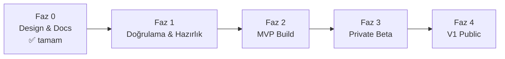

# ROADMAP.md — MVP Roadmap ve Major Milestones

> **Purpose:** Zaman planının ve milestone'ların sahibi. Scope içerikleri
> [PRD.md](PRD.md); görev kırılımı [TASKS.md](../../TASKS.md). Süreler **takvim tarihi
> değil, göreli fazlardır** — ekip büyüklüğü ve stack kararı netleşmeden tarih verilmez
> (Assumption: tek küçük ekip/tek geliştirici + coding agent çalışması).

## Fazlar

### Faz 0 — Design & Documentation ✅ (tamamlandı: 2026-07-20)

Bu documentation seti. Çıktı: vision, scope, mimari, taxonomy/matching/scraping
tasarımları, riskler, task breakdown.

### Faz 1 — Doğrulama & Hazırlık (task'lar: T-001…T-012, T-021…T-031)

Amaç: kod yazmadan önce en riskli bilinmeyenleri kapatmak — **hem arz hem talep
tarafında** (D-010).

**Milestone M1 — "Build'e hazır":**

*Arz tarafı:*
- Başlangıç source seti (2-3) belirlendi ve cluster başına ilan hacmi doğrulandı (T-003).
- Taxonomy standardı seçildi (T-004); MVP occupation template'leri hazır (T-005).
- Compliance hukuki doğrulaması yapıldı ve retention/SLA değerleri karara çevrildi (T-008).
- Golden set tasarlandı **ve çekirdek set üretildi** (T-006, T-006b).
- Employer identity resolution ve privacy inventory tasarımları tamam (T-030, T-031).
- MVP-required test/observability alt kümesi işaretlendi (T-011).
- Stack ADR'si onaylandı (T-012) → D-001 kapandı.

*Talep tarafı (D-010):*
- Yedi validation çalışması tamamlandı: T-021 (coverage), T-022 (user interview),
  T-023 (explanation), T-024 (concierge), T-025 (inter-annotator), T-026 (CV vs manuel),
  T-027 (kanal).

*Süreç:*
- Open Question Index'teki **M1-blocker** kalemler kapandı (T-001).

**Exit criteria — açık go / revise / stop kararı:**

M1, maddelerin tamamlanmasıyla **otomatik kapanmaz.** Validation sonuçları
değerlendirilir ve üç karardan biri açıkça verilir:

| Karar | Anlamı | Tetikleyen durum (örnek) |
|---|---|---|
| **Go** | Faz 2 build başlar | Validation hedefleri karşılandı veya sapmalar açıklanabilir ve kabul edilebilir |
| **Revise** | Scope/kapsam değiştirilir, sonra tekrar değerlendirilir | Coverage eşik altı → cluster/source değişikliği; kanal validation'ı e-postayı zayıf buldu → D-016 yeniden açılır |
| **Stop** | Ürün yönü yeniden düşünülür | Talep tarafı temel varsayımları (A-10, A-11) doğrulanamadı |

> **Eşik uyarısı:** Validation task'larındaki sayısal hedefler **calibration target**'tır,
> bilimsel kesinlik iddiası taşımaz ve ilk gerçek veriyle yeniden değerlendirilir. Bir
> eşiğin kıl payı kaçırılması otomatik "stop" değildir; karar gerekçesiyle yazılır.

### Faz 2 — MVP Build (task'lar: T-013…T-020)

Amaç: [PRD.md](PRD.md) → MVP Scope'un uçtan uca çalışması.

**Milestone M2 — "Core loop çalışıyor" (internal):**
- **1 source'tan** ingestion + profil oluşturma + matching v0 + explainable feed, ekip içi
  kullanımda (T-013, T-014, T-016, T-017). Cross-source dedupe M2'nin şartı **değildir**.

**Milestone M3 — "MVP feature-complete":**
- 2-3 source, duplicate/expiration handling, arama, feedback, haftalık digest, data
  rights, source transparency (T-015, T-018…T-020).
- Golden set metrikleri **ölçülüyor, trend raporlanıyor** ve sapmalar açıklanabilir
  durumda ([METRICS.md](METRICS.md) → hedef revizyon kuralı).

**Exit criteria:** MVP feature listesinin tamamı [DEFINITION_OF_DONE.md](../../DEFINITION_OF_DONE.md)
şartlarıyla Done; kritik severity bug yok; matching kalite metrikleri **hedefe ulaşmış
veya gerekçeli revize edilmiş** durumda (kalibrasyonsuz mutlak eşik tek başına kapı
değildir).

### Faz 3 — Private Beta

Amaç: gerçek kullanıcılarla (hedef: 50-200 kullanıcı, en az 4 farklı meslek grubundan —
white-collar dışı ağırlıklı) kaliteyi ölçmek.

**Milestone M4 — "Beta öğrenimi tamam":**
- Product metrics toplanıyor ve hedef bantlarda ([METRICS.md](METRICS.md)).
- Explanation kalitesi kullanıcı geri bildirimiyle revize edildi.
- Scraper health stabil (source başına uptime/quality hedefleri).
- Go/no-go kararı: V1 scope revizyonu.

### Faz 4 — V1 Public Launch

Amaç: [PRD.md](PRD.md) → V1 Scope (advanced filters, application status tracking,
feedback learning, career transition, source/occupation genişletme, çok dillilik).

**Milestone M5 — "V1 launch":**
- V1 feature seti Done; 15+ source; 50+ occupation profile.
- Feedback learning'in ranking'e ölçülebilir pozitif etkisi gösterildi.
- Operasyonel olgunluk: alerting + runbook'lar canlı kullanımda doğrulandı.

## Sıralama İlkeleri

1. **Riskli bilinmeyen önce:** taxonomy uygulanabilirliği, extraction kalitesi ve source
   compliance, UI cilasından önce gelir.
2. **Dikey dilim:** her milestone uçtan uca çalışan bir dilim üretir; hiçbir faz "sadece
   backend" olarak bitmez.
3. **Kalite kapıları:** her faz çıkışı METRICS.md hedeflerine ve DEFINITION_OF_DONE'a
   bağlıdır; tarih baskısıyla kapı atlanmaz.
