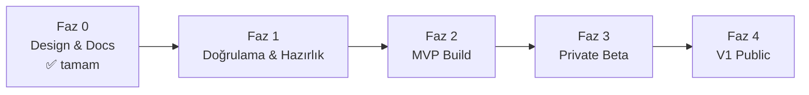

# ROADMAP.md — MVP Roadmap ve Major Milestones

> **Purpose:** Zaman planının ve milestone'ların sahibi. Scope içerikleri
> [PRD.md](PRD.md); görev kırılımı [TASKS.md](../../TASKS.md). Süreler **takvim tarihi
> değil, göreli fazlardır** — ekip büyüklüğü ve stack kararı netleşmeden tarih verilmez
> (Assumption: tek küçük ekip/tek geliştirici + coding agent çalışması).

## Fazlar

### Faz 0 — Design & Documentation ✅ (tamamlandı: 2026-07-20)

Bu documentation seti. Çıktı: vision, scope, mimari, taxonomy/matching/scraping
tasarımları, riskler, task breakdown.

### Faz 1 — Doğrulama & Hazırlık (task'lar: T-001…T-012)

Amaç: kod yazmadan önce en riskli bilinmeyenleri kapatmak.

**Milestone M1 — "Build'e hazır":**
- Pazar, başlangıç source seti (3-5) ve taxonomy standardı seçildi (T-001, T-003, T-004).
- MVP occupation seti ve qualification template'leri hazır (T-005).
- Compliance hukuki doğrulaması yapıldı (T-008).
- Matching golden set tasarımı hazır (T-006).
- Stack ADR'si onaylandı (T-012) → D-001 kapandı.

**Exit criteria:** M1 maddelerinin tamamı + kritik open question kalmaması.

### Faz 2 — MVP Build (task'lar: T-013…T-020)

Amaç: [PRD.md](PRD.md) → MVP Scope'un uçtan uca çalışması.

**Milestone M2 — "Core loop çalışıyor" (internal):**
- 1 source'tan ingestion + profil oluşturma + matching v0 + explainable feed, ekip içi
  kullanımda (T-014…T-017).

**Milestone M3 — "MVP feature-complete":**
- 3-5 source, duplicate/expiration handling, feedback, digest, data rights, source
  transparency (T-015, T-018…T-020).
- Golden set matching hedefleri karşılandı ([METRICS.md](METRICS.md)).

**Exit criteria:** MVP feature listesinin tamamı [DEFINITION_OF_DONE.md](../../DEFINITION_OF_DONE.md)
şartlarıyla Done; kritik severity bug yok.

### Faz 3 — Private Beta

Amaç: gerçek kullanıcılarla (hedef: 50-200 kullanıcı, en az 4 farklı meslek grubundan —
white-collar dışı ağırlıklı) kaliteyi ölçmek.

**Milestone M4 — "Beta öğrenimi tamam":**
- Product metrics toplanıyor ve hedef bantlarda ([METRICS.md](METRICS.md)).
- Explanation kalitesi kullanıcı geri bildirimiyle revize edildi.
- Scraper health stabil (source başına uptime/quality hedefleri).
- Go/no-go kararı: V1 scope revizyonu.

### Faz 4 — V1 Public Launch

Amaç: [PRD.md](PRD.md) → V1 Scope (advanced filters, application status tracking,
feedback learning, career transition, source/occupation genişletme, çok dillilik).

**Milestone M5 — "V1 launch":**
- V1 feature seti Done; 15+ source; 50+ occupation profile.
- Feedback learning'in ranking'e ölçülebilir pozitif etkisi gösterildi.
- Operasyonel olgunluk: alerting + runbook'lar canlı kullanımda doğrulandı.

## Sıralama İlkeleri

1. **Riskli bilinmeyen önce:** taxonomy uygulanabilirliği, extraction kalitesi ve source
   compliance, UI cilasından önce gelir.
2. **Dikey dilim:** her milestone uçtan uca çalışan bir dilim üretir; hiçbir faz "sadece
   backend" olarak bitmez.
3. **Kalite kapıları:** her faz çıkışı METRICS.md hedeflerine ve DEFINITION_OF_DONE'a
   bağlıdır; tarih baskısıyla kapı atlanmaz.
