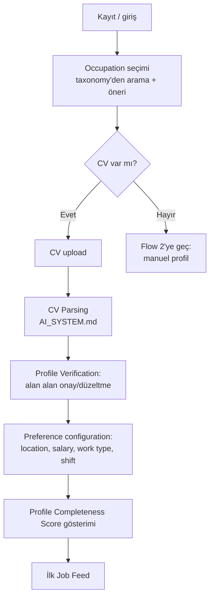
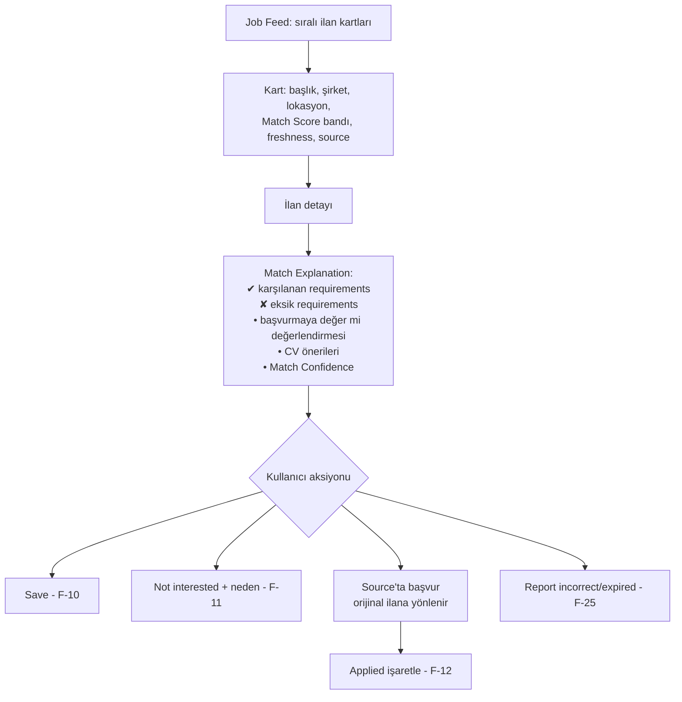

# USER_FLOWS.md — Ana User Journeys

> **Purpose:** Kullanıcının üründeki ana yolculuklarının sahibi. Ekran/etkileşim detayı
> değil, adımlar ve karar noktaları tanımlanır (wireframe çalışması:
> [TASKS.md](../../TASKS.md) → T-007). Feature scope'u [PRD.md](PRD.md); sistemin arka
> planda ne yaptığı [ARCHITECTURE.md](../architecture/ARCHITECTURE.md) → Data Flow.

## Flow 1 — Onboarding + CV ile profil oluşturma (F-01, F-02, F-04, F-05, F-06)

Kritik kurallar:
- Parse edilen hiçbir alan kullanıcı onayı olmadan "verified" sayılmaz; onaysız alanlar
  düşük Match Confidence ile işlenir.
- Occupation bulunamazsa serbest metin girilir → Manual Review Queue üzerinden taxonomy
  extension değerlendirilir ([OCCUPATION_TAXONOMY.md](../architecture/OCCUPATION_TAXONOMY.md)).
- Sensitive attribute'lar (photo, doğum tarihi vb.) CV'de bulunsa bile matching'e
  taşınmaz; kullanıcıya bunun bilgisi verilir (D-006).

## Flow 2 — CV'siz manuel profil (F-03) — P2 Hasan yolu

Adımlar: occupation seç → occupation'a özgü kısa soru seti (Occupation Profile
template'inden üretilir: ör. şoför için ehliyet kategorisi, belgeler, bölge) →
preferences → feed. Hedef: **≤5 dakika, yalnızca telefonla** tamamlanabilir olması.
Uzun serbest metin alanları opsiyoneldir.

## Flow 3 — Feed'de ilan değerlendirme + explanation (F-07, F-09, F-24)

Kritik kurallar:
- Match Score her zaman "tahmin" çerçevesiyle sunulur; kesinlik/garanti dili kullanılmaz
  (D-005). Skor tek başına değil, explanation ile birlikte gösterilir.
- Başvuru platform dışında, ilanın orijinal source'unda yapılır; source her kartta görünür.
- "Not interested" nedeni (lokasyon uzak / maaş düşük / meslek dışı…) opsiyonel ama
  sorulur — feedback learning'in ham maddesi ([MATCHING_ENGINE.md](../architecture/MATCHING_ENGINE.md) → Feedback Loop).

## Flow 4 — Bildirim ve digest (F-14, F-15)

Yeni Canonical Job Posting kullanıcının profiline eşleşirse → eşik üstü Match Score ve
yeterli Match Confidence şartıyla bildirim kuyruğuna girer → kullanıcının frekans
tercihine göre anlık bildirim veya günlük/haftalık digest'e paketlenir. Kurallar:
duplicate'ler tek gösterilir, expired ilan digest'e girmez, kullanıcı kanal/frekans/eşik
ayarı yapabilir, tek dokunuşla opt-out.

## Flow 5 — Başvuru takibi (F-12, F-13)

Kullanıcı "Applied" işaretler (A-8: beyan esaslı) → başvuru listesinde durum günceller
(applied → interview → offer → rejected/withdrawn) → sistem hatırlatma sunabilir
("2 haftadır güncellenmedi"). Bu veri aynı zamanda matching için güçlü pozitif feedback
sinyalidir.

## Flow 6 — Career transition keşfi (F-21, V1)

Kullanıcı "yakın meslekler"i açar → sistem taxonomy'deki transition ilişkileri +
transferable skill örtüşmesi üzerinden 3-5 gerçekçi hedef occupation gösterir → her
hedef için: örtüşen qualification'lar, eksikler (missing qualification recommendations,
F-20) ve o meslekteki örnek ilanlar.
**Regulated profession kuralı:** hedef meslek license gerektiriyorsa ve kullanıcıda yoksa,
öneri "önce şu license gerekir" uyarısıyla ve o license olmadan başvurulabilir yardımcı
rollerle birlikte sunulur; asla "başvurabilirsin" izlenimi verilmez.

## Flow 7 — Veri hakları (F-23)

Ayarlar → "Verilerim" → export talebi (makine-okunur format, tanımlı SLA) veya deletion
talebi (onay adımı + geri alma penceresi + kalıcı silme). Detaylı lifecycle:
[PRIVACY_SECURITY_COMPLIANCE.md](../security/PRIVACY_SECURITY_COMPLIANCE.md).

## Flow 8 — Hatalı/expired ilan raporu (F-25)

İlan detayında "Sorun bildir" → neden seçimi (expired / yanlış bilgi / dolandırıcılık
şüphesi / duplicate) → kayıt Manual Review Queue'ya düşer → review sonucu ilana işlenir
(ör. expired işaretleme) → raporlayan kullanıcıya sonuç bildirilir. Dolandırıcılık
şüphesi eşik aşarsa source'un Data Quality Score'una yansır
([SOURCE_REGISTRY.md](../architecture/SOURCE_REGISTRY.md)).
