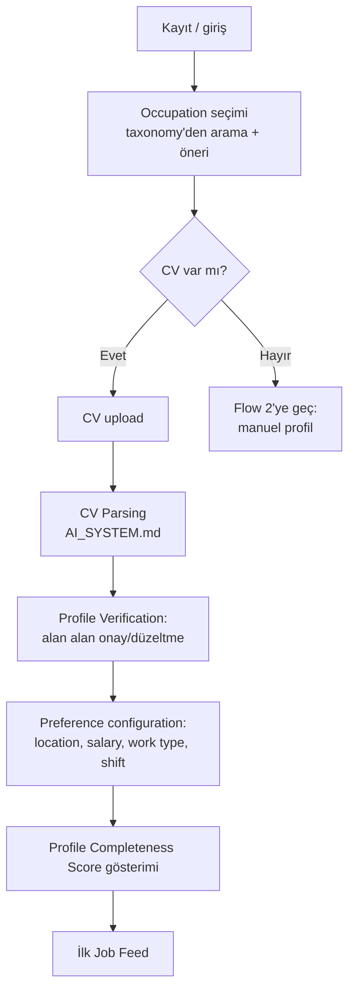
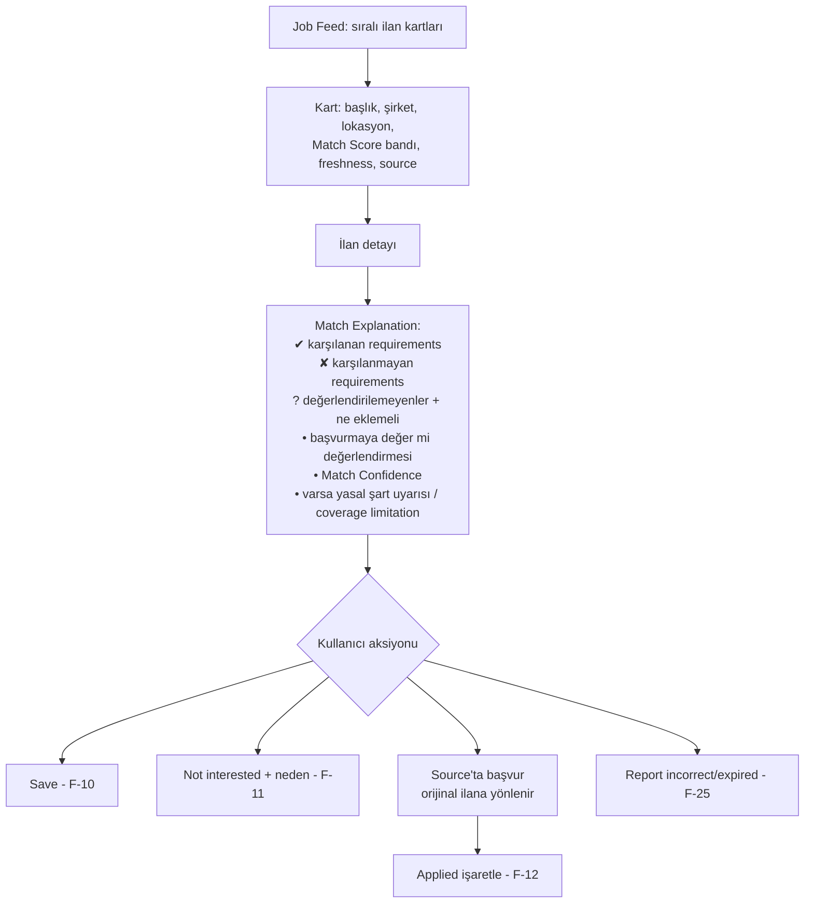

# USER_FLOWS.md — Ana User Journeys

> **Purpose:** Kullanıcının üründeki ana yolculuklarının sahibi. Ekran/etkileşim detayı
> değil, adımlar ve karar noktaları tanımlanır (wireframe çalışması:
> [TASKS.md](../../TASKS.md) → T-007). Feature scope'u [PRD.md](PRD.md); sistemin arka
> planda ne yaptığı [ARCHITECTURE.md](../architecture/ARCHITECTURE.md) → Data Flow.

## Flow 1 — Onboarding + CV ile profil oluşturma (F-01, F-02, F-04, F-05, F-06)

Kritik kurallar:
- Parse edilen hiçbir alan kullanıcı onayı olmadan `verified` sayılmaz; onaysız alanlar
  düşük Match Confidence ile işlenir.
- **Gate-relevant alanlar için doğrulama atlanamaz (D-012):** professional license
  (ehliyet kategorisi dahil), work authorization, yasal zorunlu sertifikalar ve
  country-specific authorization alanları için akış, kullanıcıyı açık bir teyit adımından
  geçirir. Kullanıcı bu adımı atlarsa alan `unverified` kalır ve ilgili hard requirement
  `unknown / verification required` olarak değerlendirilir — **`met` sayılmaz, `unmet` de
  sayılmaz.** Diğer bütün alanlar atlanabilir.
- **Sensitive alanlar hiç saklanmaz (D-006):** CV'de fotoğraf, doğum tarihi, medeni durum
  vb. bulunursa profile taslağına aktarılmadan atılır; kullanıcıya "bu bilgiler
  eşleştirmede kullanılmıyor ve saklanmıyor" bilgisi verilir.
- Occupation bulunamazsa serbest metin girilir → Manual Review Queue üzerinden taxonomy
  extension değerlendirilir ([OCCUPATION_TAXONOMY.md](../architecture/OCCUPATION_TAXONOMY.md)).
- Sensitive attribute'lar (photo, doğum tarihi vb.) CV'de bulunsa bile matching'e
  taşınmaz; kullanıcıya bunun bilgisi verilir (D-006).

## Flow 2 — CV'siz manuel profil (F-03) — P2 Hasan yolu

Adımlar: occupation seç → occupation'a özgü kısa soru seti (Occupation Profile
template'inden üretilir: ör. şoför için ehliyet kategorisi, belgeler, bölge) →
**gate-relevant alanlar için teyit adımı** → preferences → feed. Hedef: **≤5 dakika,
yalnızca telefonla** tamamlanabilir olması. Uzun serbest metin alanları opsiyoneldir.

Kritik kural: manuel girilen alan `user_asserted` statüsü alır — bu, gate-relevant
**olmayan** alanlar için yeterlidir. Gate-relevant alanlar burada da ayrı teyit adımından
geçer (D-012); geçmezse ilgili requirement `unknown` olur.

**Seyrek profil beklenir ve cezalandırılmaz:** bu akış kısa olduğu için profil doğal
olarak eksik kalır. Doldurulmayan alanlar `unknown` üretir, `unmet` değil (D-011) —
kullanıcı "eksiksin" değil, "şunu eklersen netleşir" mesajı görür (FR-411).

## Flow 3 — Feed'de ilan değerlendirme + explanation (F-07, F-09, F-24)

Kritik kurallar:
- Match Score her zaman "tahmin" çerçevesiyle sunulur; kesinlik/garanti dili veya işe
  alınma olasılığı ifadesi kullanılmaz (D-005). Skor tek başına değil, explanation ile
  birlikte gösterilir.
- **`unknown` requirement'lar ayrı bir bölümde gösterilir** — "karşılanmayan" ile aynı
  yere konmaz. Her biri için hangi bilginin eksik olduğu ve eklenirse ne değişeceği
  yazılır (FR-411).
- **Yasal şart uyarısı (D-013):** ilanda yaş/sağlık/askerlik gibi özel bir şart varsa
  bilgilendirme olarak gösterilir ve kullanıcı **orijinal ilanı kontrol etmeye**
  yönlendirilir; sistem uygun/uygunsuz kararı vermez.
- **Public sector ilanları (D-015)** ayrı gösterim modundadır: Match Score bandı yoktur,
  yerine "resmi şartları kaynaktan kontrol et" yönlendirmesi bulunur.
- **Coverage limitation:** kullanıcının occupation'ı first-class değilse kart üstünde
  sade bir açıklama gösterilir (D-008).
- Başvuru platform dışında, ilanın orijinal source'unda yapılır; source her kartta görünür.
- "Not interested" nedeni (lokasyon uzak / maaş düşük / meslek dışı…) opsiyonel ama
  sorulur — feedback learning'in ham maddesi ([MATCHING_ENGINE.md](../architecture/MATCHING_ENGINE.md) → Feedback Loop).

## Flow 4 — Haftalık digest (F-14)

**MVP davranışı (D-016):** sabit **haftalık e-posta digest**. Anlık bildirim yok, frekans
seçimi yok, kanal seçimi yok, eşik ayarı yok, push/SMS yok.

Akış: hafta boyunca kullanıcının profiline eşleşen yeni Canonical Job Posting'ler
biriktirilir → haftalık gönderimde sistem-tanımlı eşiği aşanlar paketlenir → e-posta
gönderilir. Kurallar: duplicate'ler tek gösterilir (merge geçmişi dikkate alınır),
expired ilan digest'e girmez, düşük confidence eşleşmeler digest'e girmez, public sector
ilanları digest'te listing-only rozetiyle görünür, **tek dokunuşla opt-out** ve kullanıcı
başına gönderim rate limit'i vardır.

*Frekans/kanal seçenekleri, anlık bildirim ve eşik ayarı F-15 kapsamında V1'dedir.*
Kanal etkinliği T-027 ile ölçülür; sonuç bu kararı yeniden açabilir (A-13).

## Flow 5 — Başvuru takibi (MVP: F-12 · V1: F-13)

**MVP (F-12):** Kullanıcı "Applied" işaretler (A-8: beyan esaslı) → başvuru listesinde
görür. Bu veri matching için güçlü pozitif feedback sinyalidir.

**V1 (F-13):** durum akışı (applied → interview → offer → rejected/withdrawn) ve
"2 haftadır güncellenmedi" gibi hatırlatmalar.

## Flow 6 — Career transition keşfi (F-21, V1)

Kullanıcı "yakın meslekler"i açar → sistem taxonomy'deki transition ilişkileri +
transferable skill örtüşmesi üzerinden 3-5 gerçekçi hedef occupation gösterir → her
hedef için: örtüşen qualification'lar, eksikler (missing qualification recommendations,
F-20) ve o meslekteki örnek ilanlar.
**Regulated profession kuralı:** hedef meslek license gerektiriyorsa ve kullanıcıda yoksa,
öneri "önce şu license gerekir" uyarısıyla ve o license olmadan başvurulabilir yardımcı
rollerle birlikte sunulur; asla "başvurabilirsin" izlenimi verilmez.

## Flow 7 — Veri hakları (F-23)

Ayarlar → "Verilerim" → export talebi (makine-okunur format) veya deletion talebi
(onay adımı + geri alma penceresi + kalıcı silme). Her talep bir `DataRightsRequest`
kaydı açar ve veri sınıfı bazında ilerlemesi izlenir (RB-7). Süre değerleri
**tanımlanacaktır** (❓ OPEN-05); detaylı lifecycle:
[PRIVACY_SECURITY_COMPLIANCE.md](../security/PRIVACY_SECURITY_COMPLIANCE.md).

## Flow 8 — Hatalı/expired ilan raporu (F-25)

İlan detayında "Sorun bildir" → neden seçimi (expired / yanlış bilgi / dolandırıcılık
şüphesi / duplicate) → **MVP'de basit rapor formu** olarak alınır.

İşleme kuralı (D-014 minimal mod): "expired" ve "duplicate" raporları otomatik doğrulama
tetikler (doğrulama crawl'ı öne çekilir); **yalnızca** dolandırıcılık şüphesi ve veri
kaldırma talepleri Manual Review'a düşer. Sonuç raporlayan kullanıcıya bildirilir
(FR-506).

Geri besleme: dolandırıcılık şüphesi eşik aşarsa source'un Data Quality Score'una,
**"yanlış bilgi" raporları ise source'un field accuracy boyutuna** yansır
([SOURCE_REGISTRY.md](../architecture/SOURCE_REGISTRY.md),
[SCRAPING_SYSTEM.md](../architecture/SCRAPING_SYSTEM.md) §5).

## Flow 9 — Arama ve filtreleme (F-08)

Kullanıcı arama alanına anahtar kelime girer ve/veya lokasyon filtresi uygular →
**Feed & Search Service** arama indeksinden sonuçları döner → sonuçlar Match Score
bandıyla listelenir → detaya girildiğinde tam Match Explanation açılır.

Kurallar: expired ilan arama sonucuna girmez (invariant #6); duplicate'ler canonical
düzeyinde tek görünür; public sector sonuçları listing-only rozetiyle döner; arama
sonuçları kullanıcının occupation'ıyla sınırlı **değildir** — bu, first-class olmayan
occupation kullanıcısının feed'in kaçırdığı ilana ulaşabildiği tek yüzeydir (D-008
generic tier için önemlidir).

*MVP'de yalnızca keyword + location. Advanced filters (sektör, seniority, salary, shift,
license) V1'dedir.*
